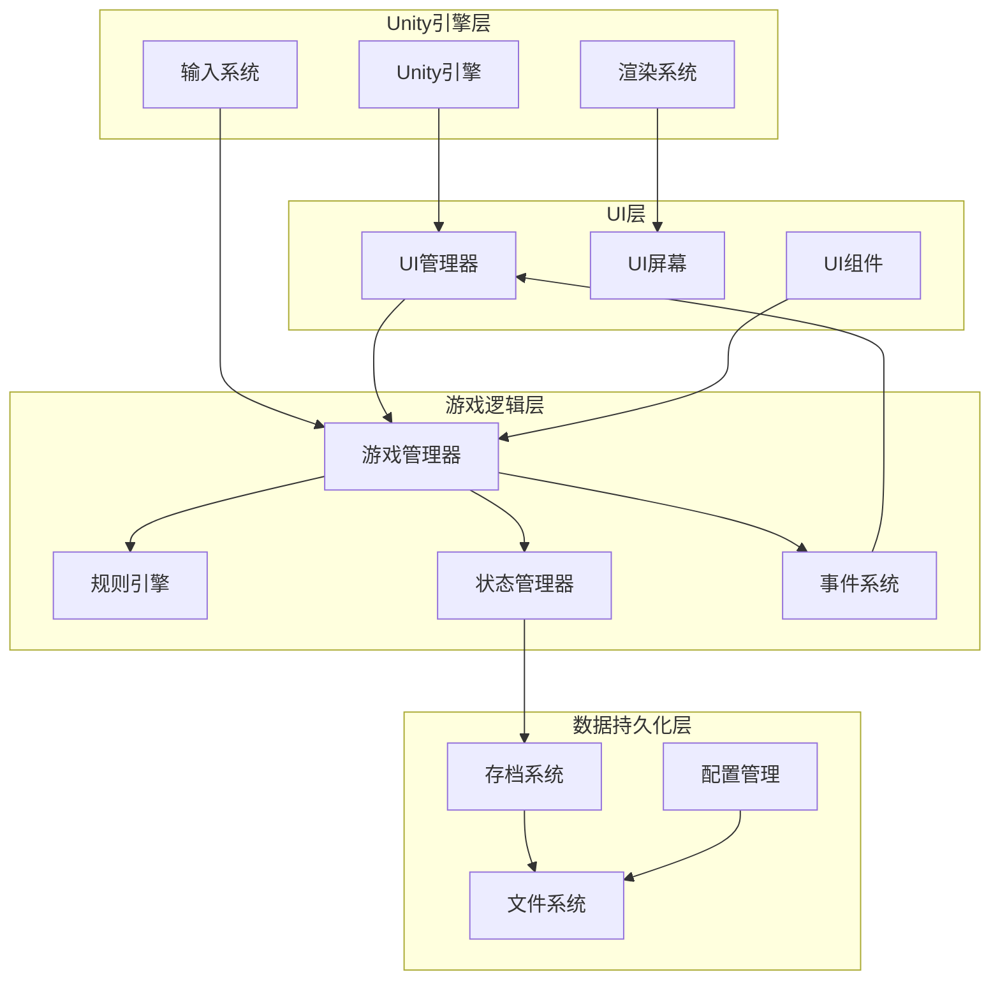
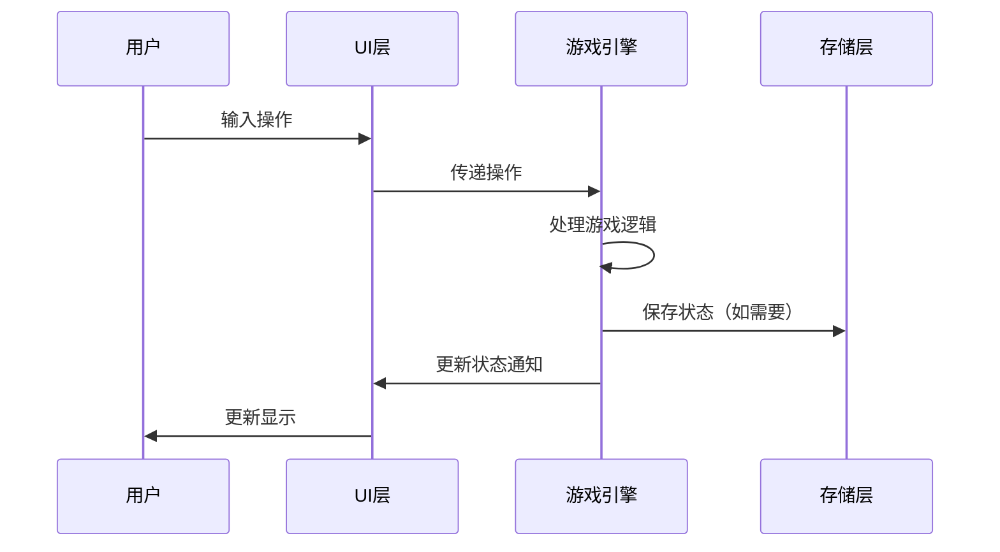

# DoomsdaySSW4 项目SPEC开发文档

## 1. 项目概述

### 1.1 项目基本信息

- **项目名称**: DoomsdaySSW4
- **项目类型**: 桌面策略游戏应用
- **开发引擎**: Unity 2021.3.40f1
- **开发语言**: C#
- **UI框架**: Unity UI (uGUI) 或 UI Toolkit
- **目标平台**: Windows/Mac/Linux（桌面平台）

### 1.2 项目目标

开发一款回合制挖矿策略游戏，玩家租借挖矿船在小行星上进行挖矿作业，通过挖掘矿石转化为金钱偿还债务，完成任务目标，并通过能源升级系统增强挖矿能力。游戏结合了租船债务管理、回合制挖矿、类Rogue升级系统和永久进度系统。

### 1.3 核心功能

- **租船和债务系统**: 玩家租借挖矿船，需要偿还债务，还清所有债务后可进行胜利结算
- **任务系统**: 基于配置表的基础任务和进阶任务系统，每个任务有回合限制，完成任务后自动领取下一个任务
- **回合制挖矿系统**: 每个回合，挖矿船按照初始装配的钻头，对钻头所在的小行星地面进行挖掘
- **钻头系统**: 钻头有挖掘范围（长宽格子数）和挖掘强度，可通过类Rogue三选一和发现失落的装备来升级
- **挖掘强度和矿石系统**: 不同类型的矿石有自己的硬度（血量），需要用挖掘强度（攻击）去抵消硬度才能钻通，矿石随挖矿深度（层数）逐渐不同
- **矿石转化系统**: 钻通的矿石自动根据不同矿石的价值转化成金钱，用于偿还债务
- **能源升级系统**: 收集能源矿石，达到一定值触发类Rogue三选一玩法，对挖掘船或勘探矿石进行升级（仅本关内生效）
- **信用积分系统**: 完成胜利结算后获得信用积分，用于永久增强挖掘船的属性
- **配置表系统**: 使用Excel配置表管理任务、矿石、钻头等游戏数据
- **存档/读档系统**: 完整的游戏进度保存和加载功能

## 2. 系统架构设计

### 2.1 整体架构

```
┌─────────────────────────────────────┐
│     Unity UI层（uGUI/UI Toolkit）    │
├─────────────────────────────────────┤
│       Unity游戏逻辑层（MonoBehaviour）│
├─────────────────────────────────────┤
│         数据持久化层（Storage）      │
└─────────────────────────────────────┘
```

**Unity架构说明**：
- **Unity引擎层**: 提供渲染、物理、输入等基础功能
- **UI层**: 使用Unity UI系统构建用户界面
- **游戏逻辑层**: 使用C#脚本和MonoBehaviour实现游戏逻辑
- **数据持久化层**: 使用Unity的PlayerPrefs或JSON文件系统

#### 2.1.1 架构流程图



#### 2.1.2 数据流向



### 2.2 模块划分

- **Unity引擎模块**: Unity引擎提供的核心功能（渲染、物理、输入等）
- **UI模块**: 使用Unity UI系统构建用户界面和交互
- **游戏逻辑模块**: 使用C#脚本实现游戏核心逻辑、规则计算
- **回合制系统模块**: 管理回合制游戏流程和回合状态
- **挖矿系统模块**: 处理挖矿操作、资源获取和地图生成
- **钻机系统模块**: 管理钻机装备、属性和升级
- **卡牌系统模块**: 处理卡牌管理、牌组构建和卡牌效果
- **消除系统模块**: 实现策略消除玩法和消除规则
- **Roguelike系统模块**: 处理随机生成、进程解锁等Roguelike元素
- **存档系统模块**: 负责游戏状态的保存和加载
- **配置管理模块**: 负责游戏配置和设置管理
- **资源管理模块**: Unity资源加载和管理系统
- **字体管理模块**: 负责动态中文字体的加载、创建和应用，使用TextMeshPro动态字体模式实现按需生成字符，节省内存

## 3. 数据结构设计

### 3.1 游戏状态数据结构

```csharp
[System.Serializable]
public class GameState
{
    // 元数据
    public string version;           // 游戏版本号
    public long timestamp;           // 状态时间戳
    public float gameTime;           // 游戏内时间（回合数或秒数）
    
    // 玩家数据
    public PlayerData player;        // 玩家数据
    
    // 游戏世界数据
    public WorldData gameWorld;      // 游戏世界数据
    
    // 游戏状态
    public GamePhase gamePhase;      // 当前游戏阶段
    public Difficulty difficulty;    // 游戏难度
    
  // 其他状态数据
  public ResourceData resources;        // 资源数据
  public List<EntityData> entities;     // 游戏实体数据
  public List<GameEvent> events;         // 游戏事件队列
  
  // 游戏机制相关状态
  public MiningData miningData;         // 挖矿系统数据
  public DrillData drillData;           // 钻头系统数据
  public TaskData taskData;             // 任务系统数据
  public DebtData debtData;              // 债务系统数据
  public EnergyData energyData;          // 能源系统数据
  public CreditData creditData;          // 信用积分系统数据
}

public enum GamePhase
{
    Menu,           // 菜单阶段
    Initializing,   // 初始化阶段
    Playing,        // 游戏进行中
    Paused,         // 暂停
    GameOver,       // 游戏结束
    Victory         // 胜利
}

public enum Difficulty
{
    Easy,
    Normal,
    Hard,
    Expert
}
```

### 3.2 玩家数据结构

```csharp
[System.Serializable]
public class PlayerData
{
    // 基本信息
    public string id;               // 玩家唯一标识
    public string name;             // 玩家名称
    
    // 游戏进度
    public int level;              // 等级（如适用）
    public int experience;         // 经验值（如适用）
    public int score;              // 分数
    
    // 统计数据
    public PlayerStats stats;      // 玩家统计数据
    
    // 其他属性（根据具体游戏玩法完善）
    public List<Item> inventory;   // 物品栏
    public List<Skill> skills;     // 技能（如适用）
    public List<string> achievements; // 成就列表
}

[System.Serializable]
public class PlayerStats
{
    public float playTime;         // 游戏时长（秒）
    public int turnsPlayed;        // 已玩回合数（如适用）
    public int actionsTaken;       // 执行的操作数
    // ... 其他统计数据
}
```

### 3.3 游戏世界数据结构

```csharp
[System.Serializable]
public class WorldData
{
    // 世界基本信息
    public string worldId;         // 世界唯一标识
    public string worldName;       // 世界名称
    public int seed;               // 随机种子（如适用）
    
    // 地图数据（根据具体游戏设计）
    public MapData map;            // 地图数据
    public List<Region> regions;   // 区域数据
    
    // 时间系统
    public int currentTurn;        // 当前回合（如适用）
    public int currentDay;         // 当前天数（如适用）
    
    // 环境数据
    public EnvironmentData environment; // 环境数据
    
    // 其他世界数据（根据具体游戏玩法完善）
}

[System.Serializable]
public class MapData
{
    public int width;
    public int height;
    public List<List<Tile>> tiles; // 地图瓦片数据
}

[System.Serializable]
public class Tile
{
    public int x;
    public int y;
    public TileType type;          // 瓦片类型
    public Dictionary<string, object> properties; // 瓦片属性
}

public enum TileType
{
    Empty,
    Terrain,
    Building,
    Resource
    // ... 其他类型
}

[System.Serializable]
public class Region
{
    public string id;
    public string name;
    public Rect bounds;
    public Dictionary<string, object> properties;
}

[System.Serializable]
public class EnvironmentData
{
    public WeatherType weather;    // 天气
    public SeasonType season;     // 季节（如适用）
    public float temperature;     // 温度（如适用）
}

public enum WeatherType
{
    Clear,
    Rain,
    Storm,
    Snow
}

public enum SeasonType
{
    Spring,
    Summer,
    Autumn,
    Winter
}
```

### 3.4 存档数据结构

```csharp
[System.Serializable]
public class SaveData
{
    // 存档元数据
    public string saveId;          // 存档唯一标识（UUID或时间戳）
    public string saveName;        // 存档名称（用户自定义）
    public long createdAt;         // 创建时间戳
    public long updatedAt;         // 最后更新时间戳
    
    // 游戏状态
    public GameState gameState;     // 完整的游戏状态
    
    // 存档信息
    public string gameVersion;     // 游戏版本
    public float playTime;         // 游戏时长（秒）
    public string thumbnail;       // 缩略图（Base64编码，可选）
    public string description;     // 存档描述（可选）
    
    // 校验信息
    public string checksum;        // 数据校验和（可选，用于验证完整性）
}

[System.Serializable]
public class SaveInfo
{
    public string saveId;
    public string saveName;
    public long createdAt;
    public long updatedAt;
    public string gameVersion;
    public float playTime;
    public string thumbnail;
    public string description;
    public long fileSize;          // 文件大小（字节）
}
```

### 3.5 资源数据结构

```csharp
[System.Serializable]
public class ResourceData
{
    public Dictionary<ResourceType, int> resources; // 资源类型到数量的映射
}

public enum ResourceType
{
    Food,           // 食物
    Water,          // 水
    Material,       // 材料
    Energy,         // 能源
    Population      // 人口
    // ... 其他资源类型（根据具体游戏设计）
}
```

### 3.6 游戏实体数据结构

```csharp
[System.Serializable]
public class EntityData
{
    public string id;              // 实体唯一标识
    public EntityType type;        // 实体类型
    public string name;            // 实体名称
    public Vector3 position;      // 位置信息（Unity Vector3）
    public Dictionary<string, object> properties; // 实体属性
    public EntityState state;      // 实体状态
}

public enum EntityType
{
    Unit,           // 单位
    Building,       // 建筑
    ResourceNode    // 资源点
    // ... 其他实体类型
}

[System.Serializable]
public class EntityState
{
    public float health;           // 生命值（如适用）
    public EntityStatus status;    // 状态
    // ... 其他状态属性
}

public enum EntityStatus
{
    Active,
    Inactive,
    Destroyed
    // ... 其他状态
}
```

### 3.7 游戏事件数据结构

```csharp
[System.Serializable]
public class GameEvent
{
    public string id;              // 事件唯一标识
    public EventType type;         // 事件类型
    public long timestamp;         // 事件时间戳
    public string source;          // 事件源
    public string target;          // 事件目标（可选）
    public Dictionary<string, object> data; // 事件数据
    public bool processed;         // 是否已处理
}

public enum EventType
{
    ResourceChange,
    EntityCreated,
    EntityDestroyed,
    TurnEnd,
    Disaster
    // ... 其他事件类型
}
```

### 3.8 配置数据结构

```csharp
[System.Serializable]
public class GameConfig
{
    // 游戏设置
    public Difficulty difficulty;  // 难度
    public GameMode gameMode;      // 游戏模式
    
    // UI设置
    public ThemeType theme;        // 主题
    public int fontSize;           // 字体大小
    public string language;        // 语言
    
    // 分辨率设置
    public int resolutionWidth;   // 分辨率宽度
    public int resolutionHeight;  // 分辨率高度
    public bool isFullscreen;     // 是否全屏模式
    public string resolutionMode; // 分辨率模式（Preset/Custom）
    
    // 音效设置
    public bool soundEnabled;      // 音效开关
    public bool musicEnabled;      // 音乐开关
    public float soundVolume;      // 音效音量（0-1）
    public float musicVolume;      // 音乐音量（0-1）
    
    // 其他设置
    public bool autoSave;          // 自动存档
    public float autoSaveInterval; // 自动存档间隔（秒）
    
    // 键位设置
    public Dictionary<string, KeyCode> keyBindings; // 快捷键映射
}

public enum GameMode
{
    Normal,
    Sandbox,
    Challenge
}

public enum ThemeType
{
    Default,
    Dark,
    Light
}
```

### 3.9 接口相关数据结构

```csharp
// 游戏引擎接口相关
[System.Serializable]
public class PlayerAction
{
    public ActionType type;        // 操作类型
    public string target;          // 目标（可选）
    public Dictionary<string, object> data; // 操作数据
    public long timestamp;         // 操作时间戳
}

public enum ActionType
{
    Move,
    Build,
    Research,
    Trade,
    Attack
    // ... 其他操作类型
}

// UI接口相关
[System.Serializable]
public class UserInput
{
    public InputType type;         // 输入类型
    public KeyCode key;            // 按键（如适用）
    public object value;           // 输入值（如适用）
    public long timestamp;        // 输入时间戳
}

public enum InputType
{
    KeyPress,
    KeyRelease,
    MouseClick,
    MouseMove,
    Command
}

[System.Serializable]
public class UIEvent
{
    public string type;           // 事件类型
    public Dictionary<string, object> data; // 事件数据
    public long timestamp;        // 事件时间戳
}
```

### 3.10 挖矿系统数据结构

```csharp
[System.Serializable]
public class MiningData
{
    // 挖矿状态
    public int currentDepth;          // 当前挖掘深度（层数）
    public int maxDepth;              // 最大挖掘深度
    public List<MiningLayer> layers;  // 各层挖矿地图
    
    // 地图尺寸（固定）
    public const int LAYER_WIDTH = 9;   // 每层宽度（列数）
    public const int LAYER_HEIGHT = 9;   // 每层高度（行数）
    
    // 资源相关
    public Dictionary<MineralType, int> minerals; // 已挖掘的矿物
    public int energy;                // 挖掘能量/体力
    public int maxEnergy;             // 最大能量
    
    // 回合相关
    public int currentTurn;           // 当前回合数
    public int actionsRemaining;      // 剩余行动点数
    public int maxActionsPerTurn;     // 每回合最大行动点数
}

[System.Serializable]
public class MiningLayer
{
    public int layerDepth;            // 层数（深度）
    public OreData[,] oreGrid;        // 矿石网格（9x9，固定尺寸）
    public Vector2Int drillCenter;   // 钻头中心点位置（默认为中心点：4,4）
}

[System.Serializable]
public class MiningTile
{
    public TileType tileType;        // 瓦片类型（岩石、矿物、空等）
    public MineralType mineralType;  // 矿物类型（如适用）
    public int hardness;              // 硬度（挖掘难度）
    public bool isRevealed;           // 是否已揭示
    public bool isMined;              // 是否已挖掘
}

public enum MineralType
{
    None,
    Iron,           // 铁
    Gold,           // 金
    Diamond,        // 钻石
    Crystal,        // 水晶
    EnergyCore      // 能量核心
    // ... 其他矿物类型
}
```

### 3.10.1 矿石生成规则数据结构

```csharp
// 矿石生成配置（从Excel配置表加载）
[System.Serializable]
public class OreSpawnConfig
{
    public int layerDepth;            // 层数（深度）
    public List<OreSpawnRule> spawnRules; // 该层的矿石生成规则
}

[System.Serializable]
public class OreSpawnRule
{
    public string oreId;              // 矿石ID（来自矿石配置表）
    public int weight;                // 出现权重
    public int maxCount;              // 最大出现数量
    public float spawnProbability;    // 生成概率（可选，基于权重计算）
    public int @default;              // 是否为该层的默认矿石（1=默认，0=非默认）
}
```

#### 3.10.2 矿石生成规则中的默认矿石逻辑（default）

- 在 `OreSpawnConfigs` 配置表中为每条规则增加一列 `default`（整型，0/1）：
  - `default = 1` 表示该矿石为该层的**默认矿石类型**
  - `default = 0` 表示普通矿石规则
- 生成流程：
  1. 正常按权重随机选出 `selectedRule`
  2. 如果 `selectedRule` 的 `maxCount` 已经达到上限，则不再使用该规则生成矿石
  3. 此时会在同一 `layerDepth` 中查找 `default = 1` 的规则，作为**兜底矿石类型**
  4. 默认矿石依然会受自身 `minDepth/maxDepth` 约束，但**不会再受 `maxCount` 限制**（可以无限生成）
  5. 如果不存在 `default = 1` 的规则，则该格子生成失败，保持为岩石格（`TileType.Rock`）

### 3.11 钻头造型系统数据结构

钻头系统采用类似俄罗斯方块的造型机制，玩家可以在9x9钻机平台上拖拽、旋转和放置多个钻头造型。

#### 3.11.1 核心概念

- **钻机平台 (DrillPlatform)**：9x9的网格区域，与挖矿地图尺寸相同，玩家在此放置钻头造型
- **钻头造型 (DrillShape)**：类似俄罗斯方块的形状，包含多个格子和特定的空间布局
- **造型特性 (ShapeTrait)**：每个造型可拥有的初始或可激活Buff（如"挖掘a类矿石时+25%攻击"）
- **攻击强度计算**：基础攻击强度 × 造型特性Buff × 挖矿船技能加成

#### 3.11.2 钻头造型配置

```csharp
/// <summary>
/// 钻头造型配置（从配置表加载）
/// </summary>
[System.Serializable]
public class DrillShapeConfig
{
    public string shapeId;                    // 造型唯一ID
    public string shapeName;                  // 造型名称
    public int baseAttackStrength;            // 单格基础攻击强度
    public List<Vector2Int> cells;            // 相对于锚点(0,0)的格子坐标列表
    public List<ShapeTraitConfig> traits;     // 造型特性列表
    public string description;                // 造型描述
}

/// <summary>
/// 造型特性配置
/// </summary>
[System.Serializable]
public class ShapeTraitConfig
{
    public string traitId;                    // 特性ID
    public string traitName;                  // 特性名称
    public string triggerCondition;           // 触发条件（如 "always", "ore_type:energy"）
    public string effectType;                 // 效果类型（如 "attack_multiplier", "attack_add"）
    public float effectValue;                 // 效果数值
    public string description;                // 特性描述
}
```

#### 3.11.3 已放置的造型实例

```csharp
/// <summary>
/// 已放置在平台上的造型实例
/// </summary>
[System.Serializable]
public class PlacedDrillShape
{
    public string instanceId;                 // 实例唯一ID
    public string shapeId;                    // 引用的造型配置ID
    public Vector2Int position;               // 在平台上的锚点位置
    public int rotation;                      // 旋转状态（0/90/180/270度）
    public List<string> activeTraits;         // 已激活的特性ID列表
}
```

#### 3.11.4 钻机平台数据

```csharp
/// <summary>
/// 钻机平台数据
/// </summary>
[System.Serializable]
public class DrillPlatformData
{
    public const int PLATFORM_SIZE = 9;              // 平台尺寸（9x9）
    public List<PlacedDrillShape> placedShapes;      // 已放置的造型列表
    public List<string> availableShapeIds;           // 可用的造型ID列表（库存）
}
```

#### 3.11.5 钻头数据（简化版）

```csharp
[System.Serializable]
public class DrillData
{
    // 钻头基本信息
    public string drillId;                    // 钻头唯一标识
    public string drillName;                  // 钻头名称
    public DrillType drillType;               // 钻头类型
    
    // 钻机平台数据（替代原有的miningRange）
    public DrillPlatformData platformData;    // 钻机平台数据
    
    // 额外属性（用于挖掘特殊矿石）
    public Dictionary<string, int> additionalAttributes;
    
    // 本关内升级（任务完成后重置）
    public int currentLevel;
    public List<DrillUpgrade> upgrades;
    
    // 永久属性（由信用积分增强）
    public int permanentStrengthBonus;
    public float permanentAttackMultiplier;   // 永久攻击倍率加成
}

public enum DrillType
{
    Default,      // 默认钻头
    Upgraded,     // 升级后钻头
    LostEquipment // 失落的装备
}

[System.Serializable]
public class DrillUpgrade
{
    public string upgradeId;
    public UpgradeType type;
    public int value;
    public string description;
    public bool isPermanent;
}

public enum UpgradeType
{
    StrengthBoost,    // 强度提升
    RangeBoost,       // 范围提升（已弃用，改用造型系统）
    NewShape,         // 获得新造型
    MiningEfficiency, // 挖掘效率提升
    EnergyBonus       // 能源加成
}
```

#### 3.11.6 造型旋转规则

- 支持90度倍数旋转（0°/90°/180°/270°）
- 旋转公式：90度顺时针旋转 `(x, y) -> (y, -x)`
- 旋转后需重新检测碰撞和边界

#### 3.11.7 放置规则

- 每个格子只能被一个造型占用（不允许重叠）
- 所有格子必须在9x9平台边界内
- 玩家只能在回合之间编辑钻机平台布局

#### 3.11.8 攻击强度计算

```
最终攻击强度 = 造型基础攻击强度 × (1 + 造型特性加成) × (1 + 挖矿船技能加成) × (1 + 永久加成)
```

每个被造型覆盖的格子都会对对应位置的矿石造成该格子的最终攻击强度伤害。

#### 3.11.9 钻头插槽系统

钻机平台（造型）可以配置钻头插槽，用于插入钻头道具，增强钻探能力。

```csharp
/// <summary>
/// 钻头插槽配置（在造型配置中定义）
/// </summary>
[Serializable]
public class DrillSlotConfig
{
    public Vector2Int position;        // 插槽在造型中的相对位置（相对于锚点）
    public DrillSlotType slotType;     // 插槽类型（1格、4格等）
    public string slotId;              // 插槽唯一ID（可选）
}

public enum DrillSlotType
{
    Single,      // 1格插槽
    Quad,        // 4格插槽（2x2）
}

/// <summary>
/// 已放置的插槽实例（在平台上）
/// </summary>
[Serializable]
public class PlacedDrillSlot
{
    public string slotId;               // 插槽唯一ID
    public Vector2Int platformPosition; // 在9x9平台上的绝对位置
    public DrillSlotType slotType;     // 插槽类型
    public string insertedBitId;       // 插入的钻头ID（如果为空则表示未插入）
    public string shapeInstanceId;     // 所属造型实例ID
}
```

#### 3.11.10 钻头道具系统

钻头是独立的道具系统，可以插入到钻机平台的插槽中，影响周围格子的钻探强度和后效。

```csharp
/// <summary>
/// 钻头配置（从配置表加载）
/// </summary>
[Serializable]
public class DrillBitConfig
{
    public string bitId;                    // 钻头唯一ID
    public string bitName;                   // 钻头名称
    public string description;               // 描述
    public DrillSlotType requiredSlotType;   // 需要的插槽类型（1格或4格）
    
    // 属性加成
    public int strengthBonus;                // 钻探强度加成（固定值）
    public float strengthMultiplier;          // 钻探强度倍率（如1.2表示+20%）
    
    // 影响范围
    public int effectRange;                  // 影响范围（格子数，如1表示相邻格子）
    public bool includeDiagonal;             // 是否包括斜角
    
    // 后效效果
    public List<DrillBitEffect> effects;     // 后效列表（如爆炸、连锁等）
    public string iconPath;                   // 图标路径
}

/// <summary>
/// 钻头后效配置
/// </summary>
[Serializable]
public class DrillBitEffect
{
    public DrillBitEffectType effectType;    // 效果类型
    public int value;                        // 效果数值
    public int range;                        // 影响范围
    public string description;               // 效果描述
}

public enum DrillBitEffectType
{
    Explosion,           // 爆炸：挖掉矿石时对周围造成伤害
    ChainReaction,       // 连锁反应
    AreaBoost,           // 区域加成
}

/// <summary>
/// 已插入的钻头实例
/// </summary>
[Serializable]
public class PlacedDrillBit
{
    public string bitId;                     // 钻头配置ID
    public string slotId;                    // 插入的插槽ID
    public Vector2Int platformPosition;      // 在平台上的位置
    public string instanceId;                // 实例唯一ID
}
```

#### 3.11.11 钻机平台数据扩展

`DrillPlatformData` 扩展支持插槽和钻头管理：

```csharp
[Serializable]
public class DrillPlatformData
{
    // ... 现有字段 ...
    
    /// <summary>
    /// 已放置的插槽列表（从已放置的造型中提取）
    /// </summary>
    public List<PlacedDrillSlot> placedSlots = new List<PlacedDrillSlot>();
    
    /// <summary>
    /// 已插入的钻头列表
    /// </summary>
    public List<PlacedDrillBit> insertedBits = new List<PlacedDrillBit>();
}
```

#### 3.11.12 造型配置扩展

`DrillShapeConfig` 扩展支持插槽配置：

```csharp
[Serializable]
public class DrillShapeConfig
{
    // ... 现有字段 ...
    
    /// <summary>
    /// 该造型上的钻头插槽配置列表
    /// </summary>
    public List<DrillSlotConfig> slots = new List<DrillSlotConfig>();
}
```

#### 3.11.13 攻击强度计算（含钻头加成）

考虑钻头加成后的攻击强度计算公式：

```
最终攻击强度 = ((基础攻击强度 + 钻头固定加成) × 造型特性倍率 × 永久倍率 + 永久固定加成) × 钻头倍率
```

其中：
- 基础攻击强度：来自造型配置的 `baseAttackStrength`
- 钻头固定加成：所有影响该格子的钻头的 `strengthBonus` 之和
- 钻头倍率：所有影响该格子的钻头的 `strengthMultiplier` 之积
- 影响范围：钻头以自己为中心，影响 `effectRange` 范围内的格子（可能包括斜角）

#### 3.11.14 钻头后效系统

当矿石被完全挖掉时，触发插入在该位置影响范围内的钻头的后效：

- **爆炸效果**：对周围 `range` 范围内的矿石造成 `value` 点伤害
- **连锁反应**：当挖掉矿石时，如果周围有相同类型的矿石，也对它们造成伤害
- **区域加成**：持续效果，不需要在挖掉时触发

后效伤害会立即应用到地图上，可能触发连锁挖掉更多矿石（但不会再次触发后效，避免无限循环）。

### 3.15 租船和债务系统数据结构

```csharp
[System.Serializable]
public class ShipRentalData
{
    // 租船信息
    public string shipId;            // 船只ID（来自配置表）
    public string shipName;           // 船只名称
    public long rentalTime;           // 租船时间戳
    public int initialDebt;           // 初始债务（来自配置表）
}

[System.Serializable]
public class DebtData
{
    // 债务信息
    public int totalDebt;            // 总债务
    public int paidDebt;              // 已还债务
    public int remainingDebt;         // 剩余债务
    
    // 还债进度
    public float repaymentProgress;   // 还债进度（0-1）
    public bool isDebtCleared;        // 是否已还清所有债务
    
    // 债务历史
    public List<DebtPayment> paymentHistory; // 还债历史记录
}

[System.Serializable]
public class DebtPayment
{
    public long timestamp;           // 还债时间戳
    public int amount;               // 还债金额
    public int remainingAfterPayment; // 还债后剩余债务
}
```

### 3.16 任务系统数据结构（任务 = 债务偿还）

```csharp
[System.Serializable]
public class TaskData
{
    // 当前任务信息
    public string currentTaskId;     // 当前任务ID（来自配置表）
    public TaskType taskType;         // 任务类型（基础任务、进阶任务）
    public int currentTaskIndex;     // 当前任务索引
    
    // 任务目标（债务偿还）
    public int targetDebtAmount;     // 目标债务金额（需要偿还的金额）
    public int currentDebtPaid;      // 当前已还债务金额
    public bool isTaskCompleted;     // 任务是否完成（是否还清目标债务）
    public bool isTaskFailed;        // 任务是否失败（回合数用完但债务未还清）
    
    // 回合限制
    public int maxTurns;             // 最大回合数（来自配置表）
    public int currentTurn;           // 当前回合数
    public int remainingTurns;       // 剩余回合数
    
    // 任务列表
    public List<string> completedTasks; // 已完成的任务ID列表
    public List<string> basicTasks;     // 基础任务ID列表（来自配置表）
    public List<string> advancedTasks; // 进阶任务ID列表（来自配置表）
}

public enum TaskType
{
    Basic,      // 基础任务
    Advanced    // 进阶任务
}

// 任务配置数据结构（从Excel配置表加载）
[System.Serializable]
public class TaskConfig
{
    public string taskId;            // 任务ID
    public string taskName;          // 任务名称
    public TaskType taskType;        // 任务类型
    public int maxTurns;              // 最大回合数
    public int targetDebtAmount;     // 目标债务金额（需要偿还的金额）
    public string nextTaskId;         // 下一个任务ID（如为空则任务链结束）
    public string description;        // 任务描述
}
```

**说明**：
- 任务系统就是债务偿还系统
- 每个任务要求：在限定的回合数内偿还指定金额的债务
- 任务完成条件：在回合限制内还清目标债务金额
- 任务失败条件：回合数用完但债务未还清
- 完成任务后自动领取下一个任务（下一个债务目标）

### 3.17 矿石系统数据结构（攻击值/血量机制）

```csharp
[System.Serializable]
public class OreData
{
    // 矿石基本信息
    public string oreId;             // 矿石ID（来自配置表）
    public string oreName;            // 矿石名称
    public OreType oreType;           // 矿石类型
    
    // 血量系统（攻击值/血量机制）
    public int maxHardness;           // 最大硬度（初始血量）
    public int currentHardness;       // 当前硬度（当前血量）
    
    // 额外属性要求
    public Dictionary<string, int> requiredDrillAttributes; // 所需额外钻头属性（如适用）
    
    // 矿石价值
    public int value;                 // 矿石价值（转化为金钱）
    public bool isEnergyOre;          // 是否为能源矿石
    public int energyValue;           // 能源值（如为能源矿石）
    
    // 位置信息
    public Vector2Int position;       // 矿石位置
    public int depth;                 // 矿石深度（层数）
    public bool isMined;              // 是否已挖掘
}

public enum OreType
{
    Common,      // 普通矿石
    Rare,        // 稀有矿石
    Energy,      // 能源矿石
    Special      // 特殊矿石（需要额外属性）
}

// 矿石配置数据结构（从Excel配置表加载）
[System.Serializable]
public class OreConfig
{
    public string oreId;             // 矿石ID
    public string oreName;            // 矿石名称
    public OreType oreType;           // 矿石类型
    public int hardness;              // 矿石硬度（初始血量）
    public Dictionary<string, int> requiredDrillAttributes; // 所需额外钻头属性（如适用）
    public int value;                 // 矿石价值
    public bool isEnergyOre;          // 是否为能源矿石
    public int energyValue;           // 能源值（如为能源矿石）
    public int minDepth;              // 最小出现深度
    public int maxDepth;              // 最大出现深度
    public float spawnProbability;    // 生成概率
}
```

### 3.18 能源系统数据结构

```csharp
[System.Serializable]
public class EnergyData
{
    // 能源值
    public int currentEnergy;         // 当前能源值
    public int totalEnergyCollected;  // 累计收集的能源值
    
    // 能源阈值（来自配置表）
    public List<int> energyThresholds; // 能源阈值列表
    public int nextThresholdIndex;     // 下一个阈值索引
    
    // 升级记录（仅本关内）
    public List<EnergyUpgrade> upgrades; // 已获得的升级
    public bool canUpgrade;            // 是否可以升级（达到阈值）
}

[System.Serializable]
public class EnergyUpgrade
{
    public string upgradeId;          // 升级ID
    public UpgradeOptionType optionType; // 升级选项类型
    public int value;                 // 升级数值
    public long timestamp;            // 获得时间戳
}

public enum UpgradeOptionType
{
    DrillStrength,      // 挖掘强度提升
    MiningEfficiency,   // 挖掘效率提升
    OreDiscovery,       // 矿石发现能力提升
    OreValueBoost,      // 矿石价值提升
    DrillShapeUnlock,   // 解锁钻头造型（将指定造型加入当前关卡可用库存）
    DrillPlatformUpgrade,  // 钻机平台升级（提升基础强度或增加插槽）
    DrillBitUnlock      // 解锁新钻头
}
```

#### 3.18.3 能源升级与钻头造型联动

- 能源三选一升级除了数值类升级（强度、效率、矿石价值、勘探能力）外，还支持一种**解锁钻头造型**的升级类型：
  - 当玩家选择 `DrillShapeUnlock` 类型的升级选项时：
    - 该升级的 `upgradeId` 与某个 `DrillShapeConfig.shapeId` 一一对应；
    - 当前关卡的 `DrillPlatformData.availableShapeIds` 中追加此 `shapeId`（若尚未存在），表示本关内可在钻机平台上装配该造型。
    - 解锁逻辑通过 `EnergyUpgradeManager.ApplyUpgradeEffect(UpgradeOptionType.DrillShapeUnlock)` 调用 `DrillPlatformManager.AddShapeToInventory(shapeId)` 实现，要求钻机平台已完成初始化（存在当前关卡的平台数据）。
    - 若在能源升级触发时平台尚未初始化，实现上需要保证**延迟添加**或**自动初始化平台后再添加**，以避免“UI 中看不到新解锁造型、无法摆放”的情况。
- 同一造型只需要解锁一次即可进入库存，后续再出现相同解锁项时可以：
  - 直接从候选池中过滤（不再出现在三选一中），或
  - 将其视为普通数值类升级（可在具体实现中调整，推荐前者以保持规则清晰）。
- 能源升级记录 `EnergyUpgrade.upgradeId` 用于追踪本关已获得的造型解锁和数值加成，便于存档和回放。

#### 3.18.4 能源三选一与钻机编辑界面联动规则

- **联动目标**：当玩家通过能源三选一选择 `DrillShapeUnlock` 类型的升级选项、成功解锁新的钻头造型后，引导玩家立即前往钻机编辑界面调整平台布局，提升“拿到新造型立刻上手”的体验。
- **基本流程**：
  1. 能源达到阈值，`EnergyUpgradeManager` 触发三选一界面，`UpgradeSelectionScreen.ShowUpgradeOptions(options)` 弹出。
  2. 玩家在三选一界面点击某个选项（包括 `DrillShapeUnlock` 在内），`UpgradeSelectionScreen.OnOptionSelected(index)` 被调用。
  3. `OnOptionSelected` 调用 `GameManager.ApplyUpgradeSelection(selectedOption)`，由 `EnergyUpgradeManager.SelectUpgrade(selectedOption)` 负责：
     - 记录本关升级；
     - 调用 `EnergyUpgradeManager.ApplyUpgradeEffect(selectedOption)`；
     - 当 `selectedOption.type == DrillShapeUnlock` 时，通过 `DrillPlatformManager.AddShapeToInventory(shapeId)` 将对应 `shapeId` 写入当前关卡的 `DrillPlatformData.availableShapeIds`。
  4. 三选一界面按原有逻辑关闭，并通过 `GameManager.ResumeGame()` 恢复游戏流程。
  5. **仅当本次选择的选项类型为 `DrillShapeUnlock` 时**，`UpgradeSelectionScreen.OnOptionSelected` 在关闭三选一界面之后，尝试自动打开钻机编辑界面：
     - 通过场景中查找（例如 `FindObjectOfType<DrillEditorScreen>(true)`）获取钻机编辑界面实例 `_drillEditorScreen`；
     - 调用 `_drillEditorScreen.CanEdit()` 判断当前是否允许编辑钻头（例如：未开启自动挖矿，且当前不在“回合结算动画处理中”等状态）；
     - 若允许编辑，则调用 `_drillEditorScreen.Show()` 打开钻机编辑界面，让玩家立即在 9x9 平台上布置新解锁的造型；
     - 若当前不允许编辑（如自动挖矿中或回合处理中），则本次不会自动打开，仅记录日志提示，玩家可以稍后通过主界面的“编辑钻头”按钮手动进入。
- **设计约束**：
  - 该联动逻辑 **只对 `DrillShapeUnlock` 类型生效**，其他数值类升级（如 `DrillStrength`、`MiningEfficiency` 等）不会自动打开钻机编辑界面，以避免频繁打断流程。
  - 自动打开钻机编辑界面的前提是三选一界面已经完成升级应用并关闭，避免 UI 相互覆盖或交互冲突。
  - 不改变原有的钻机平台数据结构和存档格式，联动仅发生在 UI 层的交互流程中。
- **接口与调用关系补充**：
  - `UpgradeSelectionScreen.OnOptionSelected(EnergyUpgradeOption selectedOption)`：
    - 负责调用 `GameManager.ApplyUpgradeSelection(selectedOption)` 完成升级应用；
    - 在 `selectedOption.type == UpgradeOptionType.DrillShapeUnlock` 且 `_drillEditorScreen.CanEdit()` 返回 true 时，直接调用 `_drillEditorScreen.Show()`。
  - `DrillEditorScreen.CanEdit()`：用于约束是否允许当前帧打开编辑界面（如：禁止在自动挖矿或回合处理中打开），三选一 → 编辑界面的联动必须遵守该规则。

### 3.18.1 能源升级进度条UI设计

能源升级进度条用于在挖矿主界面直观显示当前能源值相对于下一次升级阈值的进度。

#### 3.18.1.1 进度计算逻辑

- **数据来源**：
  - 当前能源值：`EnergyUpgradeManager.GetCurrentEnergy()`
  - 能源阈值列表：`EnergyUpgradeManager.GetEnergyData().energyThresholds`
  - 下一个阈值索引：`EnergyUpgradeManager.GetEnergyData().nextThresholdIndex`

- **进度计算公式**：
  - 设当前能源为 `E`，阈值列表为 `T = [t1, t2, t3, ...]`，下一个阈值索引为 `idx`
  - 若 `idx >= T.Count`（所有阈值已触发）：进度 = 1.0（100%）
  - 否则：
    - 下一个阈值：`nextThreshold = T[idx]`
    - 上一个阈值：`prevThreshold = idx > 0 ? T[idx - 1] : 0`
    - 进度 = `(E - prevThreshold) / (nextThreshold - prevThreshold)`
    - 进度值限制在 [0, 1] 范围内

- **进度重置**：
  - 每次触发三选一升级后，`nextThresholdIndex` 递增，进度自动回落到新的区间（从0开始）

#### 3.18.1.2 UI结构

进度条使用三层图片素材，左对齐水平显示：

```
EnergyProgressBarRoot (RectTransform)
├── BarBackgroundBottom (Image, Experience_bar_3) - 底层，永久显示，全宽
├── BarFill (Image, Experience_bar_2) - 中间层，根据进度调整宽度
└── BarForegroundTop (Image, Experience_bar_1) - 顶层，永久显示，全宽
```

- **底层 (Experience_bar_3)**：背景层，始终显示完整宽度
- **中间层 (Experience_bar_2)**：进度填充层，通过修改 `RectTransform.sizeDelta.x` 控制宽度，实现进度效果
- **顶层 (Experience_bar_1)**：装饰层，始终显示完整宽度，覆盖在中间层之上

#### 3.18.1.3 组件接口

```csharp
/// <summary>
/// 能源升级进度条组件
/// </summary>
public class EnergyProgressBar : MonoBehaviour
{
    [Header("UI引用")]
    [SerializeField] private Image bottomImage;      // 底层图片
    [SerializeField] private Image fillImage;        // 填充层图片
    [SerializeField] private Image topImage;         // 顶层图片
    [SerializeField] private TextMeshProUGUI percentText; // 可选：百分比文字
    
    private System.Func<int> _getCurrentEnergy;      // 获取当前能源的委托
    private System.Func<List<int>> _getThresholds;  // 获取阈值列表的委托
    private System.Func<int> _getNextThresholdIndex; // 获取下一个阈值索引的委托
    
    /// <summary>
    /// 初始化进度条（注入数据来源）
    /// </summary>
    public void Initialize(
        System.Func<int> getCurrentEnergy,
        System.Func<List<int>> getThresholds,
        System.Func<int> getNextThresholdIndex)
    
    /// <summary>
    /// 更新进度条显示
    /// </summary>
    public void UpdateProgress()
}
```

#### 3.18.1.4 与能源系统集成

- 进度条组件通过委托方式从 `EnergyUpgradeManager` 获取数据，避免直接依赖
- 在 `GameScreen.UpdateUI()` 中每帧调用 `UpdateProgress()` 更新显示
- 可选：订阅能源变化事件，仅在能源值变化时更新，减少性能开销

### 3.18.2 矿石视觉系统

矿石视觉系统为每种矿石提供独特的图片素材显示，替代原有的纯色背景。

#### 3.18.2.1 素材目录结构

```
DoomsdaySSW4/Assets/UI/
├── Ores/                        # 矿石素材目录
│   ├── ore_iron.png            # 铁矿石 - 灰褐色金属质感
│   ├── ore_gold.png            # 金矿石 - 金黄色闪光
│   ├── ore_diamond.png         # 钻石 - 蓝白色透明晶体
│   ├── ore_crystal.png         # 水晶 - 紫色/粉色透明
│   └── ore_energy_core.png     # 能源核心 - 绿色发光
└── Icons/                       # 图标素材目录
    └── coin.png                # 金币图标（用于飞行动画）
```

#### 3.18.2.2 配置表扩展

`OreConfigs.csv` 新增 `spritePath` 字段：

| 字段 | 类型 | 说明 |
|------|------|------|
| spritePath | string | 矿石图片资源路径（不含扩展名，相对于Resources目录） |

示例：
```csv
oreId,oreName,oreType,hardness,...,spritePath
iron,铁矿石,Common,10,...,UI/Ores/ore_iron
gold,金矿石,Rare,20,...,UI/Ores/ore_gold
```

#### 3.18.2.3 数据结构扩展

```csharp
[Serializable]
public class OreConfig
{
    // ... 现有字段 ...
    public string spritePath;    // 矿石图片资源路径
}
```

#### 3.18.2.4 瓦片渲染逻辑

`MiningMapView.CreateTile()` 渲染优先级：
1. **已挖掘格子**：显示深灰色背景
2. **空格/岩石**：显示对应颜色背景
3. **矿石格子**：
   - 如果有 `spritePath`：加载并显示矿石图片
   - 如果没有 `spritePath`：回退到根据硬度显示颜色

### 3.18.3 挖矿动效系统（扩展）

挖矿动效系统提供完整的视觉反馈，包括晃动、高亮和金钱飞行动画。

#### 3.18.3.1 动效流程时序

```
T=0.0s  │ 钻机攻击开始
        ↓
T=0.0s  │ 被攻击格子开始晃动（持续0.5秒）
        │ - 完全挖掉的格子：正常晃动
        │ - 未完全挖掉的格子：晃动 + 红色高亮闪烁
        ↓
T=0.5s  │ 晃动结束
        ↓
T=0.7s  │ 被完全挖掉的格子消失（0.2秒延迟后）
        │ 在原位置生成矿石图标
        ↓
T=1.0s  │ 矿石图标变为金币图标（0.3秒后）
        ↓
T=1.0s~ │ 金币图标飞向金钱显示位置
        │ 到达后销毁，回合逻辑继续
```

#### 3.18.3.2 晃动特效参数

```csharp
// MiningMapView 晃动配置
[Header("晃动动效设置")]
float shakeDuration = 0.5f;      // 晃动持续时间
float shakeAmplitude = 4.8f;     // 晃动幅度（像素）
float shakeFrequency = 12f;      // 晃动频率（次/秒）
```

- **晃动范围**：仅被攻击的格子晃动，其他格子保持原位
- **同步机制**：相同攻击强度的格子完全同步晃动

#### 3.18.3.3 红色高亮特效

当矿石未被完全挖掉时（`hardness > 0`），在晃动期间显示红色高亮：

```csharp
// 红色高亮参数
Color damageHighlightColor = new Color(1f, 0f, 0f, 0.4f); // 红色半透明
```

- **触发条件**：`tile.hardness > 0`（攻击后仍有剩余血量）
- **显示时机**：与晃动同步，晃动结束后恢复原色
- **混合方式**：与基础颜色进行 Lerp 混合

#### 3.18.3.4 金钱飞行动画

被完全挖掉的矿石执行金钱飞行动画：

```csharp
// 动画时间参数
float tileDisappearDelay = 0.2f;    // 晃动结束后延迟消失
float oreIconDuration = 0.3f;       // 矿石图标显示时间
float coinFlyDuration = 0.5f;       // 金币飞行时间

// 飞行动画使用缓动曲线
AnimationCurve flyCurve = AnimationCurve.EaseInOut(0, 0, 1, 1);
```

- **矿石图标**：使用矿石的 `spritePath` 加载对应素材
- **金币图标**：使用 `UI/Icons/coin` 统一素材
- **飞行目标**：`GameScreen.moneyText` 的 RectTransform 位置

#### 3.18.3.5 AttackedTileInfo 数据结构扩展

```csharp
[System.Serializable]
public class AttackedTileInfo
{
    public Vector2Int position;       // 格子坐标
    public int attackStrength;        // 攻击强度值
    public bool isFullyMined;         // 是否完全挖掉
    public int remainingHardness;     // 剩余硬度（用于显示）
    public string oreId;              // 矿石ID（用于加载图标）
    public int moneyValue;            // 金钱价值（用于飞行动画）
}
```

#### 3.18.3.6 MiningEffectsManager 组件

```csharp
/// <summary>
/// 挖矿特效管理器：协调所有挖矿视觉特效
/// </summary>
public class MiningEffectsManager : MonoBehaviour
{
    [Header("素材引用")]
    [SerializeField] private Sprite coinSprite;           // 金币图标
    [SerializeField] private RectTransform moneyUITarget; // 金钱显示位置
    
    [Header("动画参数")]
    [SerializeField] private float tileDisappearDelay = 0.2f;
    [SerializeField] private float oreIconDuration = 0.3f;
    [SerializeField] private float coinFlyDuration = 0.5f;
    
    /// <summary>
    /// 播放完整的挖矿特效序列
    /// </summary>
    public IEnumerator PlayMiningEffectSequence(
        List<AttackedTileInfo> minedTiles,
        MiningMapView miningMapView)
    
    /// <summary>
    /// 播放单个格子的金钱飞行动画
    /// </summary>
    private IEnumerator PlayCoinFlyAnimation(
        Vector2 startPosition,
        string oreId,
        int moneyValue)
}
```

### 3.19 信用积分系统数据结构

```csharp
[System.Serializable]
public class CreditData
{
    // 信用积分
    public int totalCredits;          // 总信用积分
    public int availableCredits;      // 可用信用积分
    
    // 永久增强记录
    public List<PermanentUpgrade> permanentUpgrades; // 永久升级列表
}

[System.Serializable]
public class PermanentUpgrade
{
    public string upgradeId;          // 升级ID
    public PermanentUpgradeType type; // 升级类型
    public int level;                 // 升级等级
    public int cost;                  // 升级消耗的信用积分
    public int value;                 // 升级数值
}

public enum PermanentUpgradeType
{
    BaseStrength,       // 基础挖掘强度
    BaseRange,          // 基础挖掘范围
    InitialEnergy,      // 初始能源值
    StartingMoney,      // 起始金钱
    DebtReduction       // 债务减免
}

[System.Serializable]
public class VictoryResult
{
    // 胜利结算结果
    public bool isVictory;            // 是否胜利
    public int creditsEarned;         // 获得的信用积分
    public float completionRate;      // 完成度
    public int tasksCompleted;        // 完成的任务数
    public long playTime;             // 游戏时长
}
```

### 3.12 卡牌系统数据结构

```csharp
[System.Serializable]
public class CardDeckData
{
    // 牌组信息
    public string deckId;             // 牌组ID
    public string deckName;           // 牌组名称
    public List<Card> cards;          // 牌组中的卡牌
    public int maxDeckSize;           // 最大牌组大小
    public int currentDeckSize;       // 当前牌组大小
    
    // 手牌
    public List<Card> hand;          // 当前手牌
    public int maxHandSize;           // 最大手牌数
    
    // 弃牌堆和抽牌堆
    public List<Card> discardPile;    // 弃牌堆
    public List<Card> drawPile;      // 抽牌堆
}

[System.Serializable]
public class Card
{
    // 卡牌基本信息
    public string cardId;             // 卡牌唯一标识
    public string cardName;           // 卡牌名称
    public CardType cardType;         // 卡牌类型
    public CardRarity rarity;          // 稀有度
    public int cost;                  // 使用成本（能量/资源）
    
    // 卡牌效果
    public CardEffect effect;         // 卡牌效果
    public string description;        // 卡牌描述
    
    // 卡牌属性
    public int power;                 // 力量值（如适用）
    public int durability;           // 耐久度（如适用）
    
    // 视觉效果
    public string spritePath;         // 卡牌图片路径
    public Color cardColor;           // 卡牌颜色
}

public enum CardType
{
    Action,        // 行动卡
    Equipment,     // 装备卡
    Resource,      // 资源卡
    Skill,         // 技能卡
    Special        // 特殊卡
}

public enum CardRarity
{
    Common,
    Uncommon,
    Rare,
    Epic,
    Legendary
}

[System.Serializable]
public class CardEffect
{
    public EffectType effectType;     // 效果类型
    public Dictionary<string, object> parameters; // 效果参数
    public int duration;              // 持续时间（如适用）
}

public enum EffectType
{
    Damage,           // 伤害
    Heal,            // 治疗
    ResourceGain,    // 资源获得
    PowerBoost,      // 力量提升
    DrawCard,        // 抽卡
    SpecialAction    // 特殊行动
}
```

### 3.13 消除系统数据结构

```csharp
[System.Serializable]
public class MatchData
{
    // 消除网格
    public int gridWidth;             // 网格宽度
    public int gridHeight;           // 网格高度
    public MatchTile[,] grid;         // 消除网格（二维数组）
    
    // 消除规则
    public int minMatchSize;         // 最小匹配数量
    public MatchRule matchRule;      // 匹配规则
    
    // 游戏状态
    public int score;                 // 当前分数
    public int movesRemaining;        // 剩余移动次数
    public int targetScore;           // 目标分数（如适用）
    
    // 特殊元素
    public List<SpecialTile> specialTiles; // 特殊瓦片
}

[System.Serializable]
public class MatchTile
{
    public TileColor color;          // 瓦片颜色
    public TileShape shape;          // 瓦片形状
    public bool isMatched;           // 是否已匹配
    public bool isSpecial;           // 是否为特殊瓦片
    public SpecialTileType specialType; // 特殊类型（如适用）
}

public enum TileColor
{
    Red,
    Blue,
    Green,
    Yellow,
    Purple,
    Orange
}

public enum TileShape
{
    Circle,
    Square,
    Triangle,
    Diamond,
    Star
}

public enum MatchRule
{
    Match3,        // 三消
    Match4,        // 四消
    Match5,        // 五消
    Custom         // 自定义规则
}

[System.Serializable]
public class SpecialTile
{
    public Vector2Int position;      // 位置
    public SpecialTileType type;     // 特殊类型
    public int effectValue;          // 效果数值
}

public enum SpecialTileType
{
    Bomb,           // 炸弹
    Lightning,      // 闪电
    Rainbow,        // 彩虹
    PowerUp         // 强化
}
```

### 3.14 Roguelike系统数据结构

```csharp
[System.Serializable]
public class RoguelikeData
{
    // 运行信息
    public int runNumber;            // 当前运行次数
    public bool isPermadeath;        // 是否永久死亡模式
    public float runTime;            // 当前运行时长
    
    // 进程解锁
    public List<string> unlockedItems;    // 已解锁物品
    public List<string> unlockedDrills;   // 已解锁钻机
    public List<string> unlockedCards;    // 已解锁卡牌
    public Dictionary<string, int> progressData; // 进度数据
    
    // 随机生成
    public int seed;                 // 随机种子
    public System.Random random;     // 随机数生成器
    
    // 难度曲线
    public float difficultyMultiplier; // 难度倍数
    public int depthLevel;           // 深度等级
}

[System.Serializable]
public class RunHistory
{
    public int runId;                // 运行ID
    public long startTime;           // 开始时间
    public long endTime;             // 结束时间
    public bool isCompleted;         // 是否完成
    public int finalDepth;           // 最终深度
    public int finalScore;           // 最终分数
    public Dictionary<MineralType, int> collectedMinerals; // 收集的矿物
}
```

## 4. 接口/API设计

### 4.1 游戏引擎接口（Unity MonoBehaviour）

```csharp
public class GameManager : MonoBehaviour
{
    // 启动游戏
    public void StartGame(GameConfig config) { }
    
    // 更新游戏状态（Unity Update循环）
    private void Update() { }
    
    // 处理玩家操作
    public void HandlePlayerAction(PlayerAction action) { }
    
    // 获取当前游戏状态
    public GameState GetGameState() { return null; }
    
    // 暂停/恢复游戏
    public void PauseGame() { }
    public void ResumeGame() { }
}
```

### 4.4 挖矿系统接口（攻击值/血量机制）

```csharp
public class MiningManager : MonoBehaviour
{
    // 初始化挖矿地图
    public void InitializeMiningMap(int maxDepth, int seed) { }
    
    // 生成指定层的矿石（根据配置表）
    public void GenerateLayerOres(int layerDepth, OreSpawnConfig spawnConfig) { }
    
    // 获取钻头中心点位置（默认在层中心）
    public Vector2Int GetDrillCenterPosition(int layerDepth) { return new Vector2Int(4, 4); } // 9x9的中心点
    
    // 每回合攻击矿石（攻击值/血量机制）
    public void AttackOresInRange(DrillData drill, int layerDepth) { }
    
    // 对单个矿石造成伤害
    public void DamageOre(int layerDepth, Vector2Int position, int attackValue) { }
    
    // 检查矿石是否可以被挖掉（血量归零且满足额外属性要求）
    public bool CanMineOre(OreData ore, DrillData drill) { return false; }
    
    // 挖掉矿石（收集）
    public MiningResult MineOre(int layerDepth, Vector2Int position) { return null; }
    
    // 获取挖掘范围内的所有矿石
    public List<OreData> GetOresInRange(int layerDepth, Vector2Int drillCenter, Vector2Int range) { return null; }
    
    // 揭示瓦片（不挖掘）
    public void RevealTile(int layerDepth, Vector2Int position) { }
    
    // 获取当前层的矿石网格
    public OreData[,] GetLayerOreGrid(int layerDepth) { return null; }
}

[System.Serializable]
public class MiningResult
{
    public bool success;              // 是否成功挖掉
    public OreData minedOre;          // 被挖掉的矿石
    public int moneyGained;           // 获得的金钱
    public int energyGained;           // 获得的能源（如为能源矿石）
    public List<OreData> partiallyDamagedOres; // 部分受损但未挖掉的矿石
    public List<AttackedTileInfo> attackedTiles; // 被攻击的格子信息（用于动效）
}

[System.Serializable]
public class AttackedTileInfo
{
    public Vector2Int position;       // 格子坐标
    public int attackStrength;       // 攻击强度值
}
```

### 4.4.1 挖矿动效系统

挖矿动效系统为挖矿过程提供视觉反馈，增强游戏体验。

#### 4.4.1.1 动效触发条件

- 当钻机攻击矿石时，所有被攻击的格子（无论是否被挖掉）都会触发晃动动效
- 只有被实际攻击的矿石格子才会播放动效（不包括空格或已挖掘的格子）

#### 4.4.1.2 动效特性

- **晃动中心**：以格子中心点为中心进行晃动
- **晃动方向**：随机方向晃动，使用基于攻击强度的随机种子确保相同强度产生相同的随机参数
- **持续时间**：晃动持续0.5秒
- **视觉效果**：使用随机方向的位移实现自然晃动效果

#### 4.4.1.3 同步机制

- **相同强度同步**：相同强度值的攻击使用相同的动画参数（幅度、频率、方向等）
- **完全同步**：所有被相同强度攻击的格子必须完全同步（同时开始、同时结束）
- **不同强度独立**：不同强度的攻击可以独立播放，互不影响

#### 4.4.1.4 回合控制

- **回合暂停**：晃动期间回合不前进，所有游戏逻辑暂停
- **动画完成后继续**：动画完成后才继续回合逻辑（资源处理、任务检查等）
- **UI显示**：晃动期间不得隐藏其他UI界面，仅禁用必要交互

#### 4.4.1.5 接口设计

```csharp
public class MiningMapView : MonoBehaviour
{
    // 播放晃动动画
    // attackedTiles: 被攻击的格子信息列表
    // 返回协程，用于等待动画完成
    public IEnumerator PlayShakeAnimation(List<AttackedTileInfo> attackedTiles) { }
    
    // 内部方法：晃动协程
    // tiles: 要晃动的格子GameObject列表
    // strength: 攻击强度值（用于生成一致的随机参数）
    private IEnumerator ShakeTilesCoroutine(List<GameObject> tiles, int strength) { }
}
```

#### 4.4.1.6 实现细节

- **随机种子**：使用攻击强度值作为随机种子，确保相同强度产生相同的动画参数
- **晃动幅度**：默认 4.8 像素（在原基础上提升 20%）
- **晃动频率**：建议 10-15 次/秒
- **动画曲线**：使用缓入缓出的动画曲线，使晃动更自然
- **性能优化**：如果同一帧有多个不同强度的攻击，可以合并处理

### 4.5 钻机系统接口

```csharp
public class DrillManager : MonoBehaviour
{
    // 获取当前装备的钻机
    public DrillData GetCurrentDrill() { return null; }
    
    // 装备钻机
    public void EquipDrill(string drillId) { }
    
    // 升级钻机
    public bool UpgradeDrill(string drillId) { return false; }
    
    // 修复钻机
    public void RepairDrill(string drillId, int amount) { }
    
    // 获取所有可用钻机
    public List<DrillData> GetAvailableDrills() { return null; }
    
    // 生成随机钻机（Roguelike）
    public DrillData GenerateRandomDrill(DrillRarity rarity) { return null; }
}
```

### 4.6 卡牌系统接口

```csharp
public class CardManager : MonoBehaviour
{
    // 初始化牌组
    public void InitializeDeck(CardDeckData deck) { }
    
    // 抽卡
    public Card DrawCard() { return null; }
    
    // 使用卡牌
    public bool UseCard(Card card, Vector2Int targetPosition) { return false; }
    
    // 添加卡牌到牌组
    public void AddCardToDeck(Card card) { }
    
    // 从牌组移除卡牌
    public void RemoveCardFromDeck(string cardId) { }
    
    // 洗牌
    public void ShuffleDeck() { }
    
    // 获取手牌
    public List<Card> GetHand() { return null; }
    
    // 获取牌组
    public List<Card> GetDeck() { return null; }
}
```

### 4.7 消除系统接口

```csharp
public class MatchManager : MonoBehaviour
{
    // 初始化消除网格
    public void InitializeGrid(int width, int height) { }
    
    // 检查匹配
    public List<Vector2Int> CheckMatch(Vector2Int position) { return null; }
    
    // 执行消除
    public MatchResult ExecuteMatch(List<Vector2Int> matchedTiles) { return null; }
    
    // 检查是否可以移动
    public bool CanSwap(Vector2Int pos1, Vector2Int pos2) { return false; }
    
    // 交换瓦片
    public void SwapTiles(Vector2Int pos1, Vector2Int pos2) { }
    
    // 填充空位
    public void FillEmptyTiles() { }
    
    // 检查连锁反应
    public List<Vector2Int> CheckChainReaction() { return null; }
}

[System.Serializable]
public class MatchResult
{
    public int score;
    public List<MineralType> rewards;
    public bool hasChainReaction;
    public List<Vector2Int> matchedPositions;
}
```

### 4.8 回合制系统接口

```csharp
public class TurnManager : MonoBehaviour
{
    // 开始新回合
    public void StartNewTurn() { }
    
    // 结束当前回合
    public void EndTurn() { }
    
    // 获取当前回合数
    public int GetCurrentTurn() { return 0; }
    
    // 获取剩余行动点数
    public int GetRemainingAP() { return 0; }
    
    // 消耗行动点数
    public bool ConsumeAP(int amount) { return false; }
    
    // 检查回合是否结束
    public bool IsTurnEnd() { return false; }
}
```

### 4.9 Roguelike系统接口

```csharp
public class RoguelikeManager : MonoBehaviour
{
    // 开始新运行
    public void StartNewRun() { }
    
    // 结束当前运行
    public void EndRun(bool isVictory) { }
    
    // 生成随机种子
    public int GenerateSeed() { return 0; }
    
    // 解锁内容
    public void UnlockItem(string itemId) { }
    
    // 检查是否已解锁
    public bool IsUnlocked(string itemId) { return false; }
    
    // 获取运行历史
    public List<RunHistory> GetRunHistory() { return null; }
    
    // 保存进度
    public void SaveProgress() { }
}
```

### 4.10 租船和债务系统接口

```csharp
public class ShipRentalManager : MonoBehaviour
{
    // 租借船只
    public ShipRentalData RentShip(string shipId) { return null; }
    
    // 获取当前租船信息
    public ShipRentalData GetCurrentRental() { return null; }
    
    // 还债
    public bool PayDebt(int amount) { return false; }
    
    // 获取债务信息
    public DebtData GetDebtData() { return null; }
    
    // 检查是否还清债务
    public bool IsDebtCleared() { return false; }
    
    // 计算还债进度
    public float GetRepaymentProgress() { return 0f; }
}
```

### 4.11 任务系统接口（债务偿还系统）

```csharp
public class TaskManager : MonoBehaviour
{
    // 加载任务配置（从Excel配置表）
    public void LoadTaskConfigs() { }
    
    // 开始任务（设置债务偿还目标）
    public void StartTask(string taskId) { }
    
    // 完成当前任务（还清目标债务）
    public void CompleteCurrentTask() { }
    
    // 任务失败（回合数用完但债务未还清）
    public void FailCurrentTask() { }
    
    // 自动领取下一个任务（下一个债务目标）
    public void AcceptNextTask() { }
    
    // 获取当前任务
    public TaskConfig GetCurrentTask() { return null; }
    
    // 更新债务偿还进度（由债务系统调用）
    public void UpdateDebtProgress(int paidAmount) { }
    
    // 检查任务完成条件（是否还清目标债务）
    public bool CheckTaskCompletion() { return false; }
    
    // 检查任务失败条件（回合数用完但债务未还清）
    public bool CheckTaskFailure() { return false; }
    
    // 检查回合限制
    public bool CheckTurnLimit() { return false; }
    
    // 检查是否完成所有基础任务（还清所有债务）
    public bool AreAllBasicTasksCompleted() { return false; }
    
    // 获取任务进度（已还债务 / 目标债务）
    public float GetTaskProgress() { return 0f; }
}
```

### 4.12 能源升级系统接口

```csharp
public class EnergyUpgradeManager : MonoBehaviour
{
    // 添加能源
    public void AddEnergy(int amount) { }
    
    // 获取当前能源值
    public int GetCurrentEnergy() { return 0; }
    
    // 检查是否达到阈值
    public bool CheckEnergyThreshold() { return false; }
    
    // 触发三选一升级
    public void TriggerUpgradeSelection() { }
    
    // 选择升级选项
    public void SelectUpgrade(UpgradeOptionType optionType, int value) { }
    
    // 获取可用升级选项
    public List<EnergyUpgradeOption> GetUpgradeOptions() { return null; }
    
    // 重置本关升级（任务完成后）
    public void ResetLevelUpgrades() { }
}

[System.Serializable]
public class EnergyUpgradeOption
{
    public UpgradeOptionType type;
    public string name;
    public string description;
    public int value;
}
```

### 4.13 信用积分系统接口

```csharp
public class CreditManager : MonoBehaviour
{
    // 计算胜利结算信用积分
    public int CalculateVictoryCredits(VictoryResult result) { return 0; }
    
    // 添加信用积分
    public void AddCredits(int amount) { }
    
    // 获取可用信用积分
    public int GetAvailableCredits() { return 0; }
    
    // 使用信用积分进行永久升级
    public bool PurchasePermanentUpgrade(PermanentUpgradeType type, int level) { return false; }
    
    // 获取永久升级信息
    public List<PermanentUpgrade> GetPermanentUpgrades() { return null; }
    
    // 检查是否可以购买升级
    public bool CanAffordUpgrade(PermanentUpgradeType type, int level) { return false; }
    
    // 获取升级消耗
    public int GetUpgradeCost(PermanentUpgradeType type, int level) { return 0; }
}
```

### 4.14 配置表系统接口

```csharp
public class ConfigTableManager : MonoBehaviour
{
    // 加载所有配置表（从Excel转换后的数据）
    public void LoadAllConfigs() { }
    
    // 加载任务配置表
    public void LoadTaskConfigs() { }
    
    // 加载矿石配置表
    public void LoadOreConfigs() { }
    
    // 加载矿石生成规则配置表
    public void LoadOreSpawnConfigs() { }
    
    // 加载钻头配置表
    public void LoadDrillConfigs() { }
    
    // 加载船只配置表
    public void LoadShipConfigs() { }
    
    // 加载能源阈值配置
    public void LoadEnergyThresholds() { }
    
    // 获取任务配置
    public TaskConfig GetTaskConfig(string taskId) { return null; }
    
    // 获取矿石配置
    public OreConfig GetOreConfig(string oreId) { return null; }
    
    // 获取指定层的矿石生成规则
    public OreSpawnConfig GetOreSpawnConfig(int layerDepth) { return null; }
    
    // 获取钻头配置
    public DrillConfig GetDrillConfig(string drillId) { return null; }
    
    // 获取船只配置
    public ShipConfig GetShipConfig(string shipId) { return null; }
    
    // 重新加载配置表（热更新）
    public void ReloadConfigs() { }
}
```

### 4.17 动态字体加载系统接口

```csharp
public class DynamicChineseFontLoader : MonoBehaviour
{
    // 字体配置属性（Inspector可配置）
    [SerializeField] private string sourceFontPath = "Fonts/YaHei";        // Resources路径，不含扩展名
    [SerializeField] private int samplingPointSize = 64;                   // 采样点大小
    [SerializeField] private int padding = 9;                                // 字符间距
    [SerializeField] private int atlasWidth = 512;                          // 纹理图集宽度
    [SerializeField] private int atlasHeight = 512;                         // 纹理图集高度
    [SerializeField] private GlyphRenderMode renderMode = GlyphRenderMode.SDFAA; // 渲染模式
    
    // 自动应用设置
    [SerializeField] private bool applyToAllTextsOnStart = true;            // 启动时自动应用到所有文本
    [SerializeField] private bool setAsDefaultFont = true;                  // 设置为默认字体（仅日志，实际只读）
    
    // 核心接口
    public TMP_FontAsset DynamicFont { get; }                              // 获取动态字体资源（懒加载）
    public void ApplyFontToAllTexts()                                       // 应用到所有TextMeshProUGUI组件
    public void ApplyFontToText(TextMeshProUGUI textComponent)             // 应用到指定文本组件
    public void SetAsDefaultFont()                                         // 设置默认字体（仅日志）
    public string GetMemoryInfo()                                           // 获取字体内存占用信息
    public void ClearFont()                                                // 清理字体资源
}
```

**接口说明**：
- `DynamicFont`: 属性访问器，如果字体未创建则自动创建（懒加载）
- `ApplyFontToAllTexts()`: 查找场景中所有TextMeshProUGUI组件并应用动态字体
- `ApplyFontToText()`: 为指定的文本组件设置动态字体
- `SetAsDefaultFont()`: 记录日志说明，实际无法在运行时修改TMP_Settings.defaultFontAsset（只读属性）
- `GetMemoryInfo()`: 返回字体内存占用和已生成字符数的字符串信息
- `ClearFont()`: 清理动态字体资源（谨慎使用，可能被其他对象引用）

**初始化集成**：
- 通过`GameInitializer.InitializeDynamicFont()`方法初始化
- 字体加载器使用单例模式，通过`DontDestroyOnLoad`确保跨场景存在
- 在`Start()`生命周期中自动创建字体并应用到所有文本组件

### 4.15 设置管理系统接口

```csharp
public class SettingsManager : MonoBehaviour
{
    // 设置分辨率
    public void SetResolution(int width, int height, bool fullscreen) { }
    
    // 获取可用分辨率列表
    public Resolution[] GetAvailableResolutions() { return null; }
    
    // 应用分辨率设置
    public void ApplyResolutionSettings() { }
    
    // 保存分辨率设置
    public void SaveResolutionSettings() { }
    
    // 加载分辨率设置
    public void LoadResolutionSettings() { }
    
    // 获取当前分辨率
    public Resolution GetCurrentResolution() { return new Resolution(); }
    
    // 验证分辨率是否有效
    public bool IsValidResolution(int width, int height) { return false; }
}
```

### 4.16 本地化系统接口

```csharp
public class LocalizationManager : MonoBehaviour
{
    // 设置当前语言
    public void SetLanguage(string languageCode) { }
    
    // 获取当前语言
    public string GetCurrentLanguage() { return "zh-CN"; }
    
    // 获取本地化文本
    public string GetLocalizedString(string key) { return ""; }
    
    // 获取本地化文本（带参数）
    public string GetLocalizedString(string key, params object[] args) { return ""; }
    
    // 加载语言资源
    public void LoadLanguageResource(string languageCode) { }
    
    // 获取支持的语言列表
    public List<string> GetSupportedLanguages() { return null; }
    
    // 检查语言资源是否存在
    public bool HasLanguageResource(string languageCode) { return false; }
}

[System.Serializable]
public class LocalizationData
{
    public string languageCode;              // 语言代码（如：zh-CN, en-US）
    public List<LocalizationEntry> entries;  // 本地化条目列表
}

[System.Serializable]
public class LocalizationEntry
{
    public string key;    // 文本键
    public string value;  // 文本值
}

// 钻头配置数据结构（从Excel配置表加载）
[System.Serializable]
public class DrillConfig
{
    public string drillId;
    public string drillName;
    public int baseStrength;      // 基础挖掘强度
    public Vector2Int baseRange;   // 基础挖掘范围
    public string description;
}

// 船只配置数据结构（从Excel配置表加载）
[System.Serializable]
public class ShipConfig
{
    public string shipId;
    public string shipName;
    public int initialDebt;        // 初始债务
    public string description;
}
```

### 4.2 存档系统接口

```csharp
public class SaveSystem : MonoBehaviour
{
    // 保存游戏（使用协程或异步方法）
    public IEnumerator SaveGame(string saveName) { yield return null; }
    public async Task<bool> SaveGameAsync(string saveName) { return false; }
    
    // 加载游戏
    public IEnumerator LoadGame(string saveId) { yield return null; }
    public async Task<GameState> LoadGameAsync(string saveId) { return null; }
    
    // 列出所有存档
    public List<SaveInfo> ListSaves() { return null; }
    
    // 删除存档
    public bool DeleteSave(string saveId) { return false; }
    
    // 获取存档信息
    public SaveInfo GetSaveInfo(string saveId) { return null; }
    
    // 验证存档
    public bool ValidateSave(string saveId) { return false; }
}
```

### 4.3 UI接口（Unity UI系统）

#### 4.3.1 UI管理器接口

```csharp
public class UIManager : MonoBehaviour
{
    // 显示指定屏幕
    public void ShowScreen(string screenName) { }
    
    // 隐藏当前屏幕
    public void HideScreen(string screenName) { }
    
    // 更新UI显示
    public void UpdateUI(GameState gameState) { }
    
    // 刷新UI
    public void RefreshUI() { }
}
```

#### 4.3.2 用户输入处理接口（Unity Input System）

```csharp
public class InputManager : MonoBehaviour
{
    // Unity新输入系统
    private PlayerInput playerInput;
    
    // 处理输入事件
    public void OnInput(InputAction.CallbackContext context) { }
    
    // 处理按键事件
    public void HandleKeyPress(KeyCode key) { }
    
    // 处理鼠标事件
    public void HandleMouseClick(Vector2 position) { }
}
```

#### 4.3.3 事件通知接口（Unity Events）

```csharp
public class EventManager : MonoBehaviour
{
    // Unity事件系统
    public UnityEvent<UIEvent> OnUIEvent;
    
    // 发送UI事件
    public void EmitEvent(UIEvent uiEvent) { }
    
    // 监听事件
    public void OnEvent(string eventType, UnityAction<object> callback) { }
    
    // 通知游戏状态变化
    public void NotifyGameStateChange(GameState state) { }
}
```

## 5. 实现优先级

### Phase 1: 核心基础（P0）

1. 项目初始化和基础架构搭建
2. 游戏引擎核心逻辑实现
3. 基础UI框架集成
4. 最小可玩版本（MVP）

### Phase 2: 核心功能（P1）

1. 存档系统实现
2. 游戏状态管理完善
3. UI交互优化

### Phase 3: 扩展功能（P2）

1. 其他功能实现（待补充）
2. 性能优化
3. 错误处理和异常恢复

### Phase 4: 完善和优化（P3）

1. 用户体验优化
2. 代码重构和优化
3. 文档完善

## 6. 技术实现建议

### 6.1 项目结构建议（Unity项目结构）

```
DoomsdaySSW4/
├── Assets/
│   ├── Scripts/
│   │   ├── Core/           # 游戏核心逻辑
│   │   │   ├── GameManager.cs
│   │   │   ├── GameInitializer.cs
│   │   │   ├── DynamicChineseFontLoader.cs
│   │   │   ├── RuleEngine.cs
│   │   │   └── StateManager.cs
│   │   ├── Mining/          # 挖矿系统
│   │   │   ├── MiningManager.cs
│   │   │   ├── MiningMapGenerator.cs
│   │   │   └── MiningTile.cs
│   │   ├── Drill/          # 钻机系统
│   │   │   ├── DrillManager.cs
│   │   │   ├── DrillData.cs
│   │   │   └── DrillUpgrade.cs
│   │   ├── Card/            # 卡牌系统
│   │   │   ├── CardManager.cs
│   │   │   ├── DeckBuilder.cs
│   │   │   ├── CardEffect.cs
│   │   │   └── CardData.cs
│   │   ├── Match/           # 消除系统
│   │   │   ├── MatchManager.cs
│   │   │   ├── MatchGrid.cs
│   │   │   └── MatchRule.cs
│   │   ├── Roguelike/       # Roguelike系统
│   │   │   ├── RoguelikeManager.cs
│   │   │   ├── RandomGenerator.cs
│   │   │   └── ProgressSystem.cs
│   │   ├── TurnSystem/     # 回合制系统
│   │   │   ├── TurnManager.cs
│   │   │   └── ActionPointSystem.cs
│   │   ├── UI/             # UI相关代码
│   │   │   ├── UIManager.cs
│   │   │   ├── LocalizationManager.cs
│   │   │   ├── Screens/    # UI屏幕脚本
│   │   │   └── Components/ # UI组件脚本
│   │   │       └── LocalizedText.cs
│   │   ├── Storage/        # 存档系统
│   │   │   └── SaveSystem.cs
│   │   ├── Config/         # 配置管理
│   │   │   ├── ConfigManager.cs
│   │   │   └── SettingsManager.cs
│   │   ├── Data/           # 数据结构
│   │   │   └── Models/     # 数据模型
│   │   │       └── LocalizationData.cs
│   │   ├── Events/         # 事件系统
│   │   │   └── EventManager.cs
│   │   └── Utils/          # 工具函数
│   ├── Scenes/             # Unity场景
│   │   ├── MainMenu.unity
│   │   ├── GameScene.unity
│   │   └── ...
│   ├── Prefabs/            # 预制体
│   ├── Materials/          # 材质
│   ├── Textures/           # 贴图
│   ├── Audio/              # 音频资源
│   └── Resources/          # 资源文件夹
│       ├── Fonts/          # 字体文件目录
│       │   ├── YaHei.ttf  # 微软雅黑（示例）
│       │   └── SourceHanSans.ttf  # 思源黑体（示例）
│       └── Localization/   # 本地化资源
│           ├── zh-CN.json  # 简体中文
│           ├── zh-TW.json  # 繁体中文
│           └── en-US.json # 英文
├── ProjectSettings/        # Unity项目设置
├── Packages/               # Unity包管理
├── Configs/                 # 配置表数据（Excel转换后的JSON）
│   ├── TaskConfigs.json
│   ├── OreConfigs.json
│   ├── DrillConfigs.json
│   └── ShipConfigs.json
├── ExcelConfigs/            # Excel配置表源文件
│   ├── TaskConfig.xlsx
│   ├── OreConfig.xlsx
│   ├── DrillConfig.xlsx
│   └── ShipConfig.xlsx
├── saves/                  # 存档文件目录（运行时生成）
├── docs/                   # 文档
└── tests/                  # 测试文件
```

### 6.2 技术选型建议

- **游戏引擎**: Unity 2021.3.40f1
- **开发语言**: C# (.NET Framework 4.8 或 .NET Standard 2.1)
- **UI系统**: Unity UI (uGUI) 或 UI Toolkit（推荐uGUI，更成熟稳定）
- **输入系统**: Unity Input System（新输入系统）或 Legacy Input Manager
- **数据存储**: 
  - JSON文件（存档）- 使用Unity的JsonUtility或Newtonsoft.Json
  - PlayerPrefs（简单配置）
  - ScriptableObject（游戏配置数据）
- **序列化**: JsonUtility（Unity内置）或 Newtonsoft.Json（功能更强大）
- **事件系统**: Unity Events 或 C# Events/Delegates
- **协程**: Unity Coroutines（异步操作）
- **资源管理**: Unity Resources系统或Addressables（推荐Addressables）
- **构建工具**: Unity Build Settings

### 6.3 开发规范

- 使用模块化设计，保持代码可维护性
- 实现完整的错误处理机制
- 添加日志系统便于调试
- 编写单元测试覆盖核心逻辑

### 6.4 错误处理策略

#### 6.4.1 错误分类

- **系统错误**: 文件系统错误、内存不足等系统级错误
- **游戏逻辑错误**: 规则验证失败、状态不一致等逻辑错误
- **用户输入错误**: 无效输入、格式错误等用户错误
- **数据错误**: 存档损坏、数据格式错误等数据相关错误

#### 6.4.2 错误处理机制

- **错误捕获**: 使用try-catch捕获所有可能的错误
- **错误日志**: 记录详细的错误信息到日志文件
- **用户提示**: 向用户显示友好的错误提示信息
- **错误恢复**: 尽可能提供错误恢复机制（如：自动保存、状态回滚）

#### 6.4.3 异常处理接口

```csharp
public class ErrorHandler : MonoBehaviour
{
    public void HandleError(Exception error, string context) { }
    public void LogError(Exception error, string context) { }
    public void NotifyUser(string message, ErrorType type) { }
    public IEnumerator AttemptRecovery(Exception error) { yield return null; }
}

public enum ErrorType
{
    Warning,
    Error,
    Critical
}
```

### 6.6 字体加载系统实现

#### 6.6.1 实现方案

**字体加载器组件**：
- `DynamicChineseFontLoader` MonoBehaviour组件，负责动态字体的创建和管理
- 使用TextMeshPro的`TMP_FontAsset.CreateFontAsset()`方法创建动态字体资源
- 需要`using UnityEngine.TextCore.LowLevel;`命名空间以使用`GlyphRenderMode`枚举

**初始化时机**：
- 在`GameInitializer.InitializeDynamicFont()`方法中初始化
- 字体加载器在`Start()`生命周期中自动创建字体并应用到所有文本组件
- 使用单例模式，通过`DontDestroyOnLoad`确保跨场景存在

**资源加载**：
- 使用Unity Resources系统加载源字体文件：`Resources.Load<Font>(sourceFontPath)`
- 字体文件必须放在`Assets/Resources/Fonts/`目录下
- 路径格式：不含扩展名，如`Fonts/YaHei`而不是`Fonts/YaHei.ttf`

**字体应用**：
- 通过`FindObjectsOfType<TextMeshProUGUI>(true)`查找所有文本组件
- 自动为所有TextMeshProUGUI组件设置动态字体
- 支持手动为指定文本组件应用字体

#### 6.6.2 项目结构

```
Assets/
├── Scripts/
│   └── Core/
│       ├── DynamicChineseFontLoader.cs    # 动态字体加载器
│       └── GameInitializer.cs             # 游戏初始化器（集成字体初始化）
└── Resources/
    └── Fonts/                              # 字体文件目录
        ├── YaHei.ttf                      # 微软雅黑（示例）
        └── SourceHanSans.ttf              # 思源黑体（示例）
```

#### 6.6.3 技术要点

- **TextMeshPro版本要求**：使用TextMeshPro 3.0+的动态字体功能
- **Unity版本要求**：支持Unity 2018.1+版本
- **字体文件导入**：字体文件需要正确导入Unity（检查Inspector中的导入设置）
- **性能考虑**：动态字体首次显示字符时可能有短暂延迟（<100ms），这是按需生成的正常行为
- **内存管理**：动态字体按需生成字符，初始内存占用小，随使用字符数量增长
- **命名空间依赖**：需要`using UnityEngine.TextCore.LowLevel;`以使用`GlyphRenderMode`枚举类型

### 6.5 测试策略

#### 6.5.1 测试类型

- **单元测试**: 测试各个模块的独立功能
- **集成测试**: 测试模块之间的交互
- **功能测试**: 测试游戏功能的完整性
- **性能测试**: 测试游戏性能和资源使用

#### 6.5.2 测试工具建议

- **测试框架**: Unity Test Framework (UTF)
- **单元测试**: NUnit（Unity内置）
- **集成测试**: Unity Test Runner
- **断言库**: NUnit Assertions
- **覆盖率工具**: Unity Code Coverage Package
- **模拟工具**: Unity Test Framework的Mock支持

#### 6.5.3 测试重点

- **游戏引擎核心逻辑**: 规则验证、状态转换等
- **存档系统**: 保存/加载的正确性和完整性
- **数据验证**: 数据结构的有效性和一致性
- **错误处理**: 各种错误场景的处理

## 7. 待补充内容

### 7.1 UI框架详细设计

#### 7.1.1 UI框架实现方案

**Unity UI系统选择**：

- **方案A - Unity UI (uGUI)**: Unity传统UI系统
  - 优点：成熟稳定、文档完善、社区支持好、性能优化良好
  - 缺点：代码量相对较多、布局需要手动调整
  - 适用场景：传统UI界面、复杂交互

- **方案B - UI Toolkit**: Unity新一代UI系统
  - 优点：类似Web开发体验、性能更好、支持数据绑定
  - 缺点：相对较新、部分功能可能不完善
  - 适用场景：现代化UI、需要高性能的界面

**推荐方案**: 使用Unity UI (uGUI)，因为Unity 2021.3.40f1版本中uGUI更成熟稳定，适合策略游戏的复杂UI需求

#### 7.1.2 UI组件结构设计（Unity uGUI）

```
UI系统
├── UIManager（UI管理器 MonoBehaviour）
│   ├── ScreenManager（屏幕管理器）
│   │   ├── MainMenuScreen（主菜单 Canvas）
│   │   ├── GameScreen（游戏主界面 Canvas）
│   │   ├── SaveLoadScreen（存档界面 Canvas）
│   │   └── SettingsScreen（设置界面 Canvas）
│   └── EventSystem（Unity EventSystem）
├── UI Components（Unity UI组件）
│   ├── Panel（Image/GameObject）
│   ├── Button（Unity Button）
│   ├── Text（TextMeshPro或Text）
│   ├── List（ScrollView + Content）
│   └── InputField（TMP_InputField或InputField）
└── Custom Components（自定义组件）
    ├── ResourceDisplay（资源显示组件）
    ├── EntityInfoPanel（实体信息面板）
    ├── ActionButton（操作按钮组件）
    └── LocalizedText（本地化文本组件）
```

#### 7.1.3 UI交互规范

- **输入方式**: 
  - 鼠标点击和拖拽
  - 键盘导航（方向键、Enter、Esc等）
  - 快捷键支持
- **界面布局**: 
  - 使用Unity Canvas和RectTransform进行布局
  - 支持多分辨率适配（Canvas Scaler）
  - 响应式设计，适配不同屏幕尺寸
- **状态反馈**: 
  - 使用Unity Animator实现UI动画
  - 清晰的视觉反馈和状态提示
  - 音效反馈（可选）
- **错误处理**: 
  - 使用Unity UI的Modal Dialog显示错误
  - 友好的错误提示和恢复机制
- **快捷键**: 
  - 使用Unity Input System处理快捷键
  - 支持自定义键位设置

### 7.2 游戏玩法详细设计

#### 7.2.1 游戏类型和核心机制

**游戏类型**: 回合制挖矿策略游戏

**核心玩法机制**：

1. **租船和债务系统**
   - 游戏开始时，玩家租借一艘挖矿船
   - 租船产生债务，需要在游戏过程中偿还
   - 债务金额由租船配置决定
   - 还清所有债务后，可以进行胜利结算
   - 债务系统是游戏的核心目标和压力来源

2. **任务系统（债务偿还系统）**
   - 任务系统就是债务偿还系统
   - 每个任务要求：在限定的回合数内偿还指定金额的债务
   - 任务目标：还清配置表中指定的债务金额
   - 任务完成条件：在回合限制内还清目标债务金额
   - 任务失败条件：回合数用完但债务未还清（挑战失败）
   - 完成任务后自动领取下一个任务（下一个债务目标）
   - 完成所有基础任务（还清所有债务）算作通关
   - 通关后可以选择胜利结算或继续挑战进阶任务

3. **回合制挖矿系统**
   - 每个回合，挖矿船按照初始装配的钻头进行挖掘
   - 每层地图固定为9列×9行的网格（LAYER_WIDTH = 9, LAYER_HEIGHT = 9）
   - 钻头的中心点位置默认在每层地图的中心点（4, 4）
   - 初始默认钻头范围：长5格、宽5格
   - 挖掘范围由钻头的长宽格子数决定（初始为5x5）
   - 挖掘深度（层数）向下递增，不同深度有不同的矿石分布
   - 挖掘操作是回合制，每回合执行一次挖掘

4. **钻头系统**
   - 钻头有初始的挖掘"强度"属性（攻击值）
   - 钻头的挖掘范围（长宽格子数）由钻头类型决定
   - 钻头可以拥有额外属性（用于挖掘特殊矿石）
   - 钻头可以通过以下方式升级：
     - 类Rogue三选一升级（达到能源阈值触发）
     - 发现失落的装备
   - 升级可以提升挖掘强度（攻击值）、挖掘范围、额外属性等
   - 钻头配置由Excel配置表管理

5. **挖掘强度和矿石系统（攻击值/血量机制）**
   - 钻头的挖掘强度类似"攻击值"
   - 矿石的硬度是"血量值"
   - 每回合，钻机攻击它范围内每个格子内的矿石血量
   - 攻击机制：钻头的攻击值每回合减少矿石的血量
   - 矿石的血量为零后则被挖掉（收集）
   - 部分矿石除了需要硬度（血量）变零外，还需要额外的钻头属性才能被挖掉
   - 矿石类型随挖矿深度（层数）向下逐渐不同
   - 矿石配置由Excel配置表管理，包括：
     - 矿石类型
     - 矿石硬度（初始血量）
     - 所需额外钻头属性（如适用）
     - 矿石价值（转化为金钱）
     - 出现深度范围
     - 是否为能源矿石

6. **矿石转化和还债系统**
   - 钻通的矿石自动根据不同矿石的价值转化成"金钱"
   - 金钱用于偿还租挖掘船的系列债务
   - 转化规则由配置表定义
   - 还债进度实时显示
   - 还清所有债务是胜利条件之一

7. **能源升级系统**
   - 矿石中有一种类似"能源"的特殊矿石
   - 能源叠加到挖掘船上，累计能源值
   - 达到一定系列的值时，触发挖掘船的类Rogue三选一玩法
   - 三选一升级选项包括：
     - 挖掘船属性升级（挖掘强度、挖掘范围等）
     - 勘探矿石能力升级（发现更多矿石、提高矿石价值等）
   - 这些升级仅对本关内生效（任务完成后重置）

8. **胜利结算和信用积分系统**
   - 还清所有债务后，可以进行胜利结算
   - 胜利结算获得"信用积分"
   - 信用积分可用于永久增强挖掘船的属性
   - 永久增强包括：
     - 基础挖掘强度提升
     - 基础挖掘范围提升
     - 初始能源值提升
     - 其他永久属性增强
   - 信用积分系统是游戏的永久进度系统

#### 7.2.2 游戏世界设定

**世界观**：
- **背景设定**: 末日主题（Doomsday），玩家作为挖矿船操作员，在小行星上进行挖矿作业以偿还债务
- **世界结构**: 
  - 小行星挖掘系统：玩家在小行星表面向下挖掘
  - 垂直分层结构：不同深度（层数）有不同的矿石分布
  - 配置表驱动：矿石分布、任务、钻头等由Excel配置表管理
  - 任务驱动：游戏流程由配置表中的任务序列驱动
- **环境系统**: 
  - 挖掘深度影响矿石类型和挖掘难度
  - 深度越深，矿石价值越高，但所需挖掘强度也越高
  - 特殊装备：可能发现失落的装备，提供额外升级

#### 7.2.3 玩家操作和交互方式

**基础操作**：
- **移动/导航**: 使用方向键或WASD进行界面导航
- **选择/确认**: Enter键或空格键确认操作
- **取消/返回**: Esc键返回上一级菜单
- **菜单访问**: 特定快捷键打开功能菜单

**游戏内操作**：
- **挖矿操作（攻击矿石）**: 
  - 每个回合，挖矿船按照钻头位置和范围自动攻击范围内的矿石
  - 钻头的挖掘强度（攻击值）每回合对矿石造成伤害，减少矿石的血量（硬度）
  - 矿石血量归零后则被挖掉
  - 部分矿石需要额外的钻头属性才能被挖掉
  - 挖掉的矿石自动转化为金钱
  - 能源矿石累计到能源值
- **钻头管理**: 
  - 查看当前钻头的强度和范围
  - 通过类Rogue三选一升级钻头（达到能源阈值）
  - 发现失落的装备获得升级
- **任务管理（债务偿还管理）**: 
  - 查看当前任务目标（需要偿还的债务金额）和回合限制
  - 查看债务偿还进度（已还金额 / 目标金额）
  - 完成任务后（还清目标债务）自动领取下一个任务
  - 查看任务进度和剩余回合
  - 任务失败时（回合数用完但债务未还清）显示失败提示
- **债务管理**: 
  - 查看当前债务总额和已还金额
  - 查看还债进度
  - 还清债务后触发胜利结算
- **能源升级**: 
  - 查看当前能源值
  - 达到阈值时触发三选一升级界面
  - 选择升级选项（仅本关生效）
- **胜利结算**: 
  - 还清债务后选择胜利结算
  - 获得信用积分
  - 使用信用积分进行永久增强

**钻机平台编辑交互（钻头造型系统）**：

- 钻机编辑界面允许玩家在回合之间调整 9x9 钻机平台上的造型布局，具体交互规则：
  - **库存与平台联动**：
    - 库存列表显示当前关卡可用的所有钻头造型（来源包括：船只初始配置、任务/事件奖励、能源升级 `DrillShapeUnlock` 解锁等）；
    - 平台上放置的造型会从库存中移除；移除平台造型时会将对应 `shapeId` 重新放回库存（即：**每次成功放置视为从库存中消耗 1 个该造型，移除则返还 1 个**，库存数据由 `DrillPlatformData.availableShapeIds` 维护）。
  - **鼠标左键拖动**：
    - 在库存面板中，玩家可以在单个库存项（`ShapeItem_shape` / `ShapeInventoryItem`）上按下鼠标左键并轻微拖动，进入“拖拽放置模式”：
      - 拖拽过程中鼠标可以离开库存区域，移动到 `PlatformGrid` 上方时，平台视图会根据当前鼠标所在格子位置实时计算预览形状；
      - 在平台有效格子上松开左键时，调用 `DrillPlatformManager.TryPlaceShape(shapeId, position, rotation)` 尝试放置当前造型：
        - 放置成功：从 `DrillPlatformData.availableShapeIds` 中移除一个该 `shapeId`，并刷新库存与平台显示；
        - 放置失败（越界或与现有造型重叠等）：不修改库存，仅通过状态文本提示失败原因；
      - 拖拽过程中，如果鼠标不在任一平台格子上（或离开平台区域），则不显示预览，仅保持库存选中状态；
    - 在平台上按下左键并拖动已有造型，可通过拖拽移动该造型的位置，同样遵守不重叠/不越界规则。
  - **鼠标右键旋转**：
    - 在平台上对某一格右键点击，若该格属于某个已放置造型，则选中该造型并立即顺时针旋转 90°；
    - 旋转操作同样需要通过平台边界与与其他造型的碰撞校验，失败时给出 UI 状态提示；
    - 在**从库存拖拽新造型到平台格子上**的拖拽过程中：
      - 拖拽状态保持时，**每次点击鼠标右键**都会使当前拖拽中的预览造型顺时针旋转 90°（合法角度为 0°/90°/180°/270°）；
      - 每次旋转后立即以新的旋转角度重新计算放置预览与合法性（边界 + 重叠），并刷新预览颜色：
        - 合法位置：使用配置中的 `hoverColor`（灰白/高亮）显示；
        - 非法位置：使用配置中的 `invalidColor`（红色）显示；
      - 最终在鼠标左键松开时，以玩家最后一次右键旋转后的角度调用 `TryPlaceShape(shapeId, position, rotation)` 完成落盘。
  - **确认 / 取消 / 保存 按钮**：
    - **确认**：接受当前平台布局，关闭编辑界面，本回合及后续挖矿都使用当前布局；不修改本次进入编辑前的备份数据；
    - **取消**：丢弃本次编辑会话内的所有调整，将 `DrillPlatformData` 恢复为进入编辑前的备份状态，然后关闭编辑界面；
    - **保存**：将当前平台布局写回当前钻头的 `DrillData.platformData`（用于后续回合与存档），但不关闭编辑界面，允许玩家继续微调；保存不会重置进入编辑前的备份数据，后续点击“取消”仍然表示回到进入本次编辑前的状态。

##### 7.2.1.0 钻头库存列表 UI（`DrillShapeInventory`）

- **组件职责**：
  - 作为钻机编辑界面的子组件，负责在 `InventoryPanel → Content` 容器中展示当前关卡可用的所有钻头造型库存；
  - 根据 `DrillPlatformManager.GetAvailableShapeIds()` 返回的可用造型 ID 列表，结合 `ConfigManager.GetDrillShapeConfig(shapeId)` 获取到的配置，生成一组可点击的列表项；
  - 当玩家点击某个库存造型项时，通过调用 `DrillEditorScreen.SelectInventoryShape(shapeId)` 告知编辑界面“当前准备放置的造型”，由平台视图在玩家点击平台格子时尝试放置。
- **关键引用字段**：
  - `contentContainer : RectTransform`
    - 指向 `InventoryPanel` 下用于承载所有库存列表项的 `Content` 容器；
    - 运行时会根据可用造型数量计算 `Content` 的高度，并将每个造型项的 `RectTransform` 作为子节点挂在其下；
  - `shapeItemPrefab : GameObject`
    - 用于实例化单个库存项视图的模板 GameObject；
    - 优先支持 **场景静态模板模式**：推荐在 `Content` 下预先放置一个完整的 `ShapeItem_shape` 子物体（包含背景 `Image`、`Button`、文本与预览子节点），在 `Awake/Start` 时由 `DrillShapeInventory` 自动识别并缓存为 `_templateItem`，同时将其赋值给 `shapeItemPrefab` 并隐藏（`SetActive(false)`），后续所有列表项都通过 `Instantiate(shapeItemPrefab, contentContainer)` 克隆生成；
    - 若未在场景中放置静态模板，仍可在 Inspector 中直接将某个预制体拖入 `shapeItemPrefab` 字段，逻辑保持兼容；
  - `_templateItem : GameObject`（私有运行时字段）
    - 缓存 `Content` 下找到的静态模板子物体（通常命名为 `ShapeItem_shape`，或第一个带有 `ShapeInventoryItem` 组件的子物体）；
    - 仅用作克隆源，**不会被加入运行时列表项集合，也不会在刷新时销毁**。
  - `_itemObjects : List<GameObject>`
    - 存储当前帧中通过模板克隆出来的所有库存项实例；
    - 仅包含运行时实例，不包含 `_templateItem` 本身，用于刷新、清理和更新选中高亮状态。
- **生命周期与初始化流程**：
  - `Awake()`：
    - 获取 `DrillPlatformManager.Instance` 与 `ConfigManager.Instance` 单例；
    - 如果 `shapeItemPrefab` 为空，则在 `contentContainer` 的子物体中：
      - 优先查找名称为 `ShapeItem_shape` 的子物体；
      - 若未找到则退而求其次，查找第一个挂有 `ShapeInventoryItem` 组件的子物体；
      - 将找到的子物体缓存到 `_templateItem`，同时赋值给 `shapeItemPrefab` 并执行 `_templateItem.SetActive(false)` 隐藏模板；
    - 如果 `shapeItemPrefab` 非空且本身就是 `contentContainer` 的子物体，同样将其视为 `_templateItem` 并在运行时隐藏；
  - `Start()`：
    - 调用 `Refresh()`，根据当前可用造型构建库存列表；
  - `Refresh()`：
    - 调用 `_platformManager.GetAvailableShapeIds()` 获取可用造型 ID 列表；
    - 使用 `_itemObjects` 记录的实例逐个 `Destroy` 并清空列表，**不影响 `_templateItem` 本身**；
    - 根据造型数量和 `itemHeight + itemSpacing` 重新计算并设置 `contentContainer` 高度；
    - 遍历每个 `shapeId`，通过 `ConfigManager.GetDrillShapeConfig` 获取配置，调用 `CreateShapeItem(config, yOffset)` 使用 `shapeItemPrefab` 克隆出对应的库存项，并加入 `_itemObjects`；
    - 最后调用 `UpdateSelection()` 根据 `_selectedShapeId` 更新背景色高亮状态；
  - `CreateShapeItem(config, yOffset)`：
    - 使用 `Instantiate(shapeItemPrefab, contentContainer)` 克隆出一个新的库存项；
    - 设置其 `RectTransform` 布局参数（锚点、尺寸、高度偏移等）；
    - 如果克隆出的对象上挂有 `ShapeInventoryItem` 组件，则调用 `Setup(config, this)` 将配置数据绑定到 UI 文本；
    - 在其 `Button` 上挂接点击事件，使其调用 `OnShapeItemClicked(config.shapeId)`，进而通过 `DrillEditorScreen.SelectInventoryShape` 通知编辑界面；
    - 通过 `FontHelper.ApplyFontToGameObject` 应用动态字体，保证中文显示完整；
  - `OnShapeItemClicked(shapeId)` / `UpdateSelection()`：
    - 维护 `_selectedShapeId` 当前选中的库存造型 ID；
    - 遍历 `_itemObjects`，根据 `shapeId == _selectedShapeId` 切换背景色（`normalColor / selectedColor`），实现列表中的选中高亮。

##### 7.2.1.1 钻机平台UI组件（`DrillPlatformView`）

- **组件职责**：
  - 在钻机编辑界面中，以 9x9 网格方式可视化当前 `DrillPlatformData`；
  - 显示已放置造型的占用格子、高亮当前选中造型，并在鼠标悬停时给出放置预览（合法=灰白预览、非法=红色预览）；
  - 作为 `DrillEditorScreen` 的子组件，响应其库存选择、已放置造型选择、移动与旋转指令。
- **关键引用字段**：
  - `gridContainer : RectTransform`  
    - 必须在 Unity Inspector 中手动绑定到钻机编辑界面下用于承载 9x9 单元格的容器节点（推荐命名：`PlatformGrid`，位于 `DrillEditorPanel` / `DrillEditorScreen` Canvas 层次结构下）；  
    - 运行时 **禁止为空**：若为空将无法完成格子初始化，`InitGridFromChildren()` 会记录错误日志；  
    - 防御性默认行为：若未在 Inspector 绑定且当前 `GameObject` 本身挂有 `RectTransform`，则在初始化时自动将自身的 `RectTransform` 作为 `gridContainer` 使用，并记录一条调试日志，**仍然强烈建议在预制体/场景上显式绑定正确的容器节点**，避免后续布局结构调整导致平台网格位置异常。
  - `_cellObjects : Dictionary<Vector2Int, GameObject>`  
    - 键为平台坐标（`(x, y)`，范围 `[0, DrillPlatformData.PLATFORM_SIZE)`，左下角为 `(0,0)`，右上角为 `(8,8)`），值为场景中对应的格子 GameObject；  
    - 由初始化流程根据 `gridContainer` 下的子节点与其挂载的 `DrillPlatformCell` 数据自动构建。
- **平台格子静态化与布局规范**：
  - **静态格子设计**：
    - `DrillEditorPanel/PlatformGrid` 下预先放置 81 个格子子节点，每个子节点代表 9x9 平台中的一个格子；
    - 每个格子节点都挂载轻量标记组件 `DrillPlatformCell`，内部至少包含其平台坐标信息（`x`, `y` 或 `gridPosition : Vector2Int`），坐标范围为 0~8；
    - 允许使用 `GridLayoutGroup` 或手动调整 `RectTransform.anchoredPosition` / `sizeDelta` 以满足美术布局，只要 81 个格子坐标准确覆盖 9x9 全平台即可。
  - **`DrillPlatformCell` 数据结构（UI 标记组件）**：
    - 伪代码示例：  
      ```csharp
      public class DrillPlatformCell : MonoBehaviour
      {
          [Range(0, DrillPlatformData.PLATFORM_SIZE - 1)]
          public int x;
          [Range(0, DrillPlatformData.PLATFORM_SIZE - 1)]
          public int y;

          public Vector2Int GridPosition => new Vector2Int(x, y);

          // 可选缓存：用于减少运行时 GetComponent 调用
          [HideInInspector] public Image image;
          [HideInInspector] public Button button;
          [HideInInspector] public EventTrigger eventTrigger;
      }
      ```
    - `DrillPlatformCell` 仅承担“标记 + 坐标”职责，不持有钻头逻辑数据，不参与存档。
  - **初始化流程（`InitGridFromChildren()`）**：
    - `Awake()`：获取 `DrillPlatformManager.Instance` 与 `ConfigManager.Instance` 单例；  
    - `Start()`：调用 `InitGridFromChildren()`，从 `gridContainer` 下的子节点收集所有 `DrillPlatformCell` 并构建 `_cellObjects`，然后调用 `Refresh()` 同步显示；
    - `InitGridFromChildren()` 约定行为：
      - 校验 `gridContainer != null`，否则：
        - 通过 Unity 日志输出错误 `"DrillPlatformView: gridContainer未设置"`；
        - 直接 `return`，不再尝试初始化格子；
      - 调用 `GetComponentsInChildren<DrillPlatformCell>(true)` 遍历所有格子标记组件：
        - 对每个 `DrillPlatformCell` 读取其 `GridPosition`（或 `x`,`y`），检查坐标在 `[0, DrillPlatformData.PLATFORM_SIZE)` 范围内；
        - 若存在重复坐标或越界坐标，记录清晰的错误日志（包含重复的 `(x,y)` 值与节点名称），并跳过这些节点；
        - 对每个有效格子，确保其上存在 `Image`、`Button`、`EventTrigger` 组件：若缺失则在运行时通过 `AddComponent` 自动补齐；
        - 为 `Button` 绑定 `OnCellClicked(position)` 回调，为 `EventTrigger` 绑定 `PointerEnter/Exit` 事件，分别调用 `OnCellHoverEnter(position)` 与 `OnCellHoverExit()`；
        - 将 `position` 与对应的 `GameObject` 写入 `_cellObjects[position]`。
  - **事件与交互绑定**：
    - 每个格子：
      - 挂载 `Button`：左键点击时调用 `OnCellClicked(position)`，最终委托到 `DrillEditorScreen.TryPlaceAtPosition(position)`；
      - 挂载 `EventTrigger`：`PointerEnter/Exit` 事件更新 `_hoveredCell` 并调用 `UpdateHoverPreview()` / `ClearHoverPreview()`；
    - `DrillPlatformView` 继续直接实现 `IPointerDownHandler / IDragHandler / IPointerUpHandler / IPointerClickHandler`：
      - 左键按下：根据是否有待放置造型（库存）与当前格子是否存在已放置造型，分别进入“拖拽新造型”或“拖动已放置造型”模式；
      - 拖拽中：实时更新拖拽目标格子、高亮预览或调用 `DrillEditorScreen.TryMoveSelectedShape` 尝试移动；
      - 左键松开：若当前为“拖拽新造型”模式，则在当前位置调用一次 `TryPlaceAtPosition` 完成放置；
      - 右键点击：命中已有造型时，调用 `DrillEditorScreen.SelectPlacedShape + RotateSelectedShape(true)` 实现就地顺时针旋转。
  - **错误与调试约定**：
    - 若运行时报出 `"DrillPlatformView: gridContainer未设置"`：
      - 首先检查 `DrillPlatformView` 挂载的 GameObject 是否处于激活状态，以及其 Canvas/父节点是否在当前场景中可见；
      - 确认 `gridContainer` 字段已在 Inspector 中正确拖拽绑定到 `PlatformGrid` 的 RectTransform；  
    - 若运行时报出“重复坐标”或“格子坐标越界”等日志：
      - 在 Unity 层次视图中检查 `PlatformGrid` 下格子节点的 `DrillPlatformCell.x / y` 配置是否有冲突或缺失；
      - 调整后重新运行，确保 81 个格子覆盖 `(0,0)` 到 `(8,8)` 的所有坐标。

#### 7.2.4 游戏流程设计

```
游戏流程
├── 初始化阶段
│   ├── 加载Excel配置表（任务、矿石、矿石生成规则、钻头）
│   ├── 租借挖矿船（产生初始债务）
│   ├── 初始化默认钻头（攻击值、范围5x5、中心点位置）
│   ├── 生成小行星挖矿地图
│   │   ├── 设定每层地图尺寸（长9格、宽7格）
│   │   ├── 根据层数加载矿石生成规则配置
│   │   ├── 按照权重和最大数量生成每层矿石
│   │   └── 设置钻头中心点位置（默认在层中心）
│   ├── 加载第一个基础任务
│   └── 设置初始状态（金钱、能源、回合数）
├── 任务循环（债务偿还循环）
│   ├── 任务开始
│   │   ├── 显示任务目标（需要偿还的债务金额）和回合限制
│   │   ├── 设置目标债务金额（来自配置表）
│   │   └── 重置任务相关状态
│   ├── 回合制主循环（在任务回合限制内）
│   │   ├── 回合开始
│   │   │   ├── 检查回合限制
│   │   │   └── 更新UI显示（债务进度、剩余回合）
│   │   ├── 挖掘阶段（攻击矿石）
│   │   │   ├── 根据钻头位置和范围确定攻击范围
│   │   │   ├── 对范围内每个格子的矿石造成攻击值伤害（减少矿石血量）
│   │   │   ├── 检查矿石血量是否归零
│   │   │   ├── 检查是否满足额外钻头属性要求（如适用）
│   │   │   ├── 挖掉矿石（血量归零且满足额外要求）
│   │   │   ├── 挖掉的矿石转化为金钱
│   │   │   ├── 累计能源值（如为能源矿石）
│   │   │   └── 检查是否触发能源升级（三选一）
│   │   ├── 还债阶段
│   │   │   ├── 金钱自动用于偿还债务
│   │   │   ├── 更新已还债务金额
│   │   │   └── 更新任务进度
│   │   ├── 升级阶段（如触发）
│   │   │   ├── 显示三选一升级选项
│   │   │   ├── 玩家选择升级
│   │   │   └── 应用升级效果（仅本关生效）
│   │   ├── 回合结算
│   │   │   ├── 检查任务完成条件（是否还清目标债务）
│   │   │   ├── 检查任务失败条件（回合数用完但债务未还清）
│   │   │   └── 检查胜利/失败条件
│   │   └── 回合结束
│   │       └── 准备下一回合
│   ├── 任务完成/失败检查
│   │   ├── 如果任务完成（还清目标债务）
│   │   │   ├── 完成任务奖励
│   │   │   └── 自动领取下一个任务（下一个债务目标）
│   │   └── 如果任务失败（回合数用完但债务未还清）
│   │       └── 挑战失败，游戏结束
│   └── 任务循环继续（直到完成所有基础任务或任务失败）
├── 通关检查
│   ├── 检查是否完成所有基础任务
│   ├── 显示通关提示
│   └── 选择：胜利结算 或 继续挑战进阶任务
├── 胜利结算阶段（如选择结算）
│   ├── 检查是否还清所有债务
│   ├── 计算信用积分
│   ├── 显示结算界面
│   └── 使用信用积分进行永久增强
└── 结束阶段
    ├── 保存永久进度（信用积分、解锁内容）
    ├── 保存游戏状态
    └── 返回主菜单或开始新游戏
```

#### 7.2.5 游戏规则系统

**规则引擎设计**：
- **规则定义**: 使用Excel配置表定义游戏规则和数据
- **配置表管理**: Excel配置表通过工具转换为Unity可用的数据格式（ScriptableObject或JSON）
- **规则验证**: 验证玩家操作是否符合游戏规则
  - 挖矿规则：验证挖掘强度是否足够钻通矿石
  - 任务规则：验证任务完成条件、回合限制
  - 债务规则：验证还债进度、胜利条件
  - 升级规则：验证能源阈值、升级条件
- **规则执行**: 执行规则产生的效果和影响
  - 挖掘效果：钻通矿石、转化为金钱、累计能源
  - 任务效果：完成任务、领取新任务
  - 还债效果：扣除债务、检查胜利条件
  - 升级效果：应用升级、仅本关生效
- **规则扩展**: 通过修改Excel配置表扩展游戏内容

**具体规则**：

1. **挖矿规则（攻击值/血量机制）**
   - 每个回合，挖矿船按照钻头位置和范围自动攻击范围内的矿石
   - 钻头的挖掘强度是"攻击值"，矿石的硬度是"血量值"
   - 攻击机制：每回合，钻头对范围内每个格子内的矿石造成攻击值伤害，减少矿石的血量
   - 矿石血量归零后则被挖掉（收集）
   - 部分矿石除了需要血量归零外，还需要额外的钻头属性才能被挖掉
   - 挖掉的矿石立即转化为金钱（根据配置表的价值）
   - 能源矿石累计到能源值，不转化为金钱
   - 挖掘深度（层数）影响矿石类型、硬度和所需额外属性
   - **挖矿地图尺寸规则**：
     - 每层地图固定为9列×9行的网格（LAYER_WIDTH = 9, LAYER_HEIGHT = 9）
     - 钻头的中心点位置默认在每层地图的中心点（4, 4）
     - 地图尺寸由常量定义，不可动态修改
   - **挖矿地图高亮规则**：
     - 在挖矿地图上，根据钻头的攻击范围进行视觉高亮显示
     - 高亮规则：在钻头攻击范围内的格子会高亮显示（混合淡黄色，30%混合度）
     - 变暗规则：不在攻击范围内的格子会变暗显示（降低透明度至30%）
     - 高亮计算：基于钻头中心位置（layer.drillCenter）和有效攻击范围（drill.GetEffectiveRange()）计算
     - 攻击范围计算：以钻头中心为基准，计算矩形攻击区域（minX, maxX, minY, maxY）
     - 高亮更新：地图更新时自动刷新高亮状态，钻头范围变化时也会自动更新
     - 高亮配置：可通过MiningMapView组件的Inspector配置高亮颜色、变暗透明度、是否启用高亮
  - **挖矿地图迷雾遮罩规则**：
     - 在挖矿地图上显示黑色迷雾遮罩，从地图边缘向中心扩展
     - 迷雾效果：使用黑色半透明遮罩覆盖未探索区域，营造探索感
     - 实现方式：使用自定义Shader（UI/FogMask）实现，单个Image组件 + Material，性能更好，效果更平滑
     - 无迷雾区域：钻头格子及其周围一定半径内的格子完全无迷雾（alpha = 0）
     - 渐变效果：从无迷雾区域向外，根据到最近钻头格子的距离线性增加迷雾透明度
     - 距离计算：在Shader的Fragment Shader中，将UV坐标转换为网格坐标，遍历附近格子（搜索半径 = revealRadius + fadeDistance），通过采样攻击范围纹理（_AttackRangeTex）找到所有钻头格子，计算当前像素到最近钻头格子的欧几里得距离
     - 最近钻头格子搜索算法：
       - 对于每个像素，在搜索半径内遍历附近的所有格子
       - 对每个格子采样攻击范围纹理，如果值>0.5则表示是钻头格子
       - 计算到所有钻头格子的距离，取最小值作为最终距离
       - 搜索范围限制在ceil(revealRadius + fadeDistance)内，避免全图遍历，优化性能
     - 透明度算法（在Shader中计算）：
       - 如果当前像素在攻击范围内（通过纹理采样判断）：alpha = 0（完全透明，无迷雾）
       - 如果到最近钻头格子的距离 <= revealRadius：alpha = 0（完全透明，无迷雾）
       - 如果距离 > revealRadius + fadeDistance：alpha = maxFogAlpha（完全迷雾）
       - 否则：alpha = (distance - revealRadius) / fadeDistance * maxFogAlpha（线性插值）
     - 攻击范围处理：使用Texture2D（9x9）存储攻击范围掩码，传递给Shader，Shader中采样纹理判断当前像素是否在攻击范围内，并用于查找最近的钻头格子
     - 更新机制：实时更新，当钻头位置或攻击范围变化时立即刷新Material参数和攻击范围纹理
     - 更新时机：地图更新时（UpdateMap调用时）、钻头位置变化时、攻击范围变化时
     - 配置参数：可通过FogMaskView组件的Inspector配置迷雾颜色、最大透明度、无迷雾半径（revealRadius）、渐变距离（fadeDistance）等
     - UI层级：FogMaskContainer作为MiningMapContainer的子对象，遮罩层显示在格子层之上
     - 性能优势：从81个GameObject减少到1个，大幅降低DrawCall，Shader计算支持像素级渐变，效果更自然；搜索算法针对9x9小网格优化，搜索半径通常为5-6格，性能可接受
  - **挖矿地图颜色规则（硬度区间配置表）**：
    - 仅矿石格子使用配置表颜色映射；空/岩石格子保持原固定颜色
    - 已挖掘格子使用图片显示：`Resources/UI/Lattice/Lattice_null.png`
    - 配置文件：`Resources/Configs/TileHardnessColorConfigs.json`
    - 匹配规则：按 `maxHardness` 升序匹配，选择第一个 `hardness <= maxHardness` 的颜色
    - 边界处理：硬度大于最大阈值时使用最后一个颜色；配置缺失或为空则回退为最低硬度颜色
  - **已挖掘格子显示规则**：
    - 已挖掘的格子优先使用图片 `Lattice_null` 显示
    - 图片路径：`Resources/UI/Lattice/Lattice_null`
    - 如果图片加载失败，回退使用深灰色显示（RGB(0.2, 0.2, 0.2)）
  - **硬度颜色配置表数据结构**：
    - `TileHardnessColorConfigCollection`：包含 `thresholds` 列表
    - `TileHardnessColorThreshold`：
      - `maxHardness`（int）：硬度上限（含）
      - `colorHex`（string）：Hex颜色（不含 #，如 `E3C176`）

3. **任务规则（债务偿还规则）**
   - 每个任务就是要求在限定回合数内偿还指定金额的债务
   - 任务目标：还清配置表中指定的债务金额
   - 任务完成条件：在回合限制内还清目标债务金额
   - 任务失败条件：回合数用完但债务未还清（挑战失败，游戏结束）
   - 完成任务后自动领取下一个任务（下一个债务目标）
   - 完成所有基础任务（还清所有债务）算作通关
   - 通关后可以选择胜利结算或继续挑战进阶任务

4. **债务规则**
   - 租船时产生初始债务（由配置表定义）
   - 金钱自动用于偿还债务
   - 还清所有债务是胜利结算的条件之一
   - 债务进度实时显示

5. **钻头规则（攻击值机制）**
   - 钻头有挖掘强度（攻击值，初始由默认钻头决定）
   - 钻头有挖掘范围（长宽格子数，初始由默认钻头决定）
   - 钻头可以拥有额外属性（用于挖掘特殊矿石）
   - 钻头可以通过类Rogue三选一升级：
     - 数值类：提升攻击值、挖掘效率、矿石价值、勘探能力等；
     - 造型类：通过 `DrillShapeUnlock` 解锁新的钻头造型（`DrillShapeConfig`），并加入当前关卡的钻机平台库存（`DrillPlatformData.availableShapeIds`），玩家可在平台上放置该造型。
   - 钻头可以通过发现失落的装备升级
   - 升级效果仅本关内生效

6. **能源升级规则**
   - 能源值达到配置表中定义的阈值时触发三选一升级
   - 三选一选项包括：
     - 挖掘船属性升级（挖掘强度、挖掘效率、矿石价值、勘探能力等）
     - 勘探矿石能力升级（发现更多矿石、提高矿石价值等）
     - 解锁新的钻头造型（`DrillShapeUnlock`）：将配置表中指定的 `shapeId` 加入当前关卡的钻机平台库存，供玩家在钻机平台编辑界面中拖拽放置
   - 升级效果仅本关内生效（任务完成后重置）
   - 能源值可以多次达到阈值，触发多次升级
   - 每次触发升级后，当前能源值会扣除本次升级所需的阈值数值（例如：当前能源为102点，阈值为100点，则触发升级后能源变为2点）

7. **信用积分规则**
   - 胜利结算时获得信用积分（根据还债进度、任务完成情况等计算）
   - 信用积分用于永久增强挖掘船属性
   - 永久增强包括基础挖掘强度、基础挖掘范围等
   - 信用积分永久保存，跨游戏会话有效

8. **UI显示规则**
   - **挖矿地图自适应规则**：
     - 挖矿地图支持自适应大小调整，根据父容器（LeftPanel）的大小自动计算格子大小
     - 自适应计算公式：格子大小 = (可用空间 - 间距总宽度) / 格子数量
     - 可用空间 = 容器大小 - padding（左右/上下）
     - 间距总宽度 = 间距 × (格子数量 - 1)
     - 支持配置：是否启用自适应（autoResize）、是否使用父容器大小（useParentSize）、格子间距（spacing）
     - 当容器大小变化时，自动重新计算格子大小（OnRectTransformDimensionsChange回调）
   - **Canvas保持激活规则**：
     - Canvas组件在运行时必须始终保持激活状态
     - 使用CanvasKeeper组件确保Canvas在Awake、OnEnable、Start、Update等生命周期中保持激活
     - 当Canvas被意外禁用时，自动在下一帧重新激活（通过协程实现）
     - 防止在退出Play模式时触发协程错误（检查Application.isPlaying和gameObject.activeInHierarchy）
   - **动态字体加载规则**：
     - **字体加载方式**：使用TextMeshPro动态字体模式（AtlasPopulationMode.Dynamic）
     - **按需生成**：字体资源创建时纹理图集为空，当文本显示新字符时Unity自动生成到纹理图集
     - **内存优化**：初始内存占用最小（~0.5-1MB），随使用字符数量逐渐增长
     - **字体文件位置**：源字体文件必须放在 `Assets/Resources/Fonts/` 目录下
     - **字体路径配置**：使用Resources路径格式，不含扩展名（如：`Fonts/YaHei`）
     - **自动应用**：启动时自动查找所有TextMeshProUGUI组件并应用动态字体
     - **单例管理**：DynamicChineseFontLoader使用单例模式，DontDestroyOnLoad确保跨场景存在
     - **内存监控**：提供GetMemoryInfo()方法监控字体内存占用和已生成字符数
     - **默认字体限制**：TMP_Settings.defaultFontAsset是只读属性，无法在运行时修改，通过ApplyFontToAllTexts()实现实际效果
     - **字体配置参数**：
       - 采样点大小（samplingPointSize）：默认64，降低可节省约30%内存
       - 纹理图集尺寸（atlasWidth/Height）：默认512x512，降低可节省约75%内存
       - 渲染模式（renderMode）：默认SDFAA（Signed Distance Field Anti-Aliasing）
       - 字符间距（padding）：默认9像素
     - **内存占用对比**：
       - 动态字体（方案A）：初始~0.5-1MB，使用100个中文字符后~3-8MB
       - 静态字体（最小字符集）：~2-5MB
       - 静态字体（常用字符集）：~10-30MB
       - 静态字体（完整字符集）：~50-200MB
  - **升级界面背景图规则**：
    - UpgradeSelectionScreen 的 BackgroundImage 始终保持激活状态
    - BackgroundImage 不随三选一面板的显示/隐藏切换激活状态

9. **分辨率设置规则**
   - 支持预设分辨率选项和自定义分辨率输入
   - 预设分辨率包括：1920x1080、1680x1050、1600x900、1440x900、1366x768、1280x720、1024x768
   - 支持全屏/窗口模式切换
   - 自动检测系统支持的分辨率列表（通过Screen.resolutions）
   - 分辨率设置持久化保存（使用PlayerPrefs或JSON配置文件）
   - 游戏启动时自动加载并应用保存的分辨率设置
   - 分辨率验证：验证用户输入的分辨率是否在系统支持范围内
   - 分辨率应用：使用Screen.SetResolution(width, height, fullscreen)设置分辨率

10. **本地化规则**
   - 支持多语言切换：简体中文（zh-CN）、繁体中文（zh-TW）、英文（en-US）
   - 语言资源文件使用JSON格式存储（位于Assets/Resources/Localization/）
   - 语言代码使用标准格式（zh-CN, zh-TW, en-US）
   - 文本键值对映射系统：键为文本ID，值为翻译文本
   - 支持运行时动态切换语言（通过LocalizationManager.SetLanguage()）
   - 语言设置持久化保存（使用PlayerPrefs）
   - 游戏启动时自动加载保存的语言设置
   - UI组件通过LocalizedText组件或LocalizationManager.GetLocalizedString()获取本地化文本
   - 支持带参数的文本格式化（GetLocalizedString(key, params object[] args)）

### 7.3 配置表系统详细设计

#### 7.3.1 Excel配置表设计

**配置表文件结构与编码规范**：

- 所有 Excel / CSV 配置文件统一使用 **UTF-8 编码**（推荐带 BOM），以确保 Unity 与文本编辑器中中文字段不会出现乱码
- 配置文件保存/导出时需要显式选择 UTF-8 编码格式，避免默认 ANSI 或 GBK 导致的"�"字符
- 若发现已有配置表出现乱码（例如 `DrillShapeConfigs_钻头造型配置表_示例.csv`），需要先根据设计含义恢复中文，再重新以 UTF-8 编码保存

1. **任务配置表（TaskConfig.xlsx）**
   - 列：任务ID、任务名称、任务类型、最大回合数、目标债务金额、下一个任务ID、描述
   - 用途：定义基础任务和进阶任务的序列、债务偿还目标、回合限制等
   - 说明：任务目标就是偿还指定金额的债务

2. **矿石配置表（OreConfig.xlsx）**
   - 列：矿石ID、矿石名称、矿石类型、矿石硬度（初始血量）、所需额外钻头属性（如适用）、矿石价值、是否为能源矿石、能源值、最小深度、最大深度、生成概率
   - 用途：定义所有矿石类型、属性、出现条件等
   - 说明：矿石硬度是血量值，每回合被钻头攻击值伤害；部分矿石需要额外钻头属性才能被挖掉

3. **矿石生成规则配置表（OreSpawnConfig.xlsx）**
   - 列：层数、矿石ID、出现权重、最大出现数量
   - 用途：定义每层可以出现哪些矿石、不同矿石的出现权重和最大出现数量
   - 说明：按照层数分别设定，用于生成每层的矿石分布

4. **钻头配置表（DrillConfig.xlsx）**
   - 列：钻头ID、钻头名称、基础挖掘强度（攻击值）、基础挖掘范围（长）、基础挖掘范围（宽）、额外属性（如适用）、描述
   - 用途：定义默认钻头和可解锁钻头的属性
   - 说明：挖掘强度是攻击值，每回合对矿石造成伤害；额外属性用于挖掘特殊矿石
   - 初始默认钻头：长5格、宽5格

5. **船只配置表（ShipConfig.xlsx）**
   - 列：船只ID、船只名称、初始债务、描述
   - 用途：定义可租借的船只及其初始债务

6. **能源阈值配置表（EnergyThresholdConfig.xlsx）**
   - 列：阈值索引、能源值、描述
   - 用途：定义触发三选一升级的能源阈值序列

7. **钻头造型配置表示例（DrillShapeConfigs_钻头造型配置表_示例.csv）**
   - 列：`shapeId`、`shapeName`、`baseAttackStrength`、`cells`、`traits`、`description`
   - 用途：以 CSV 示例形式给出若干典型钻头造型（十字形、直线、L 形、T 形、方块形、Z/S 形、能源提取专用等），并作为能源升级系统中 `DrillShapeUnlock` 选项的来源表：
     - 对于每一条 `shapeId`，可以在 `EnergyUpgradeConfigs` 中增加一条对应的“解锁钻头造型”升级配置行（`type = DrillShapeUnlock`，`upgradeId` 与 `shapeId` 对应），用于在三选一中解锁该造型。
   - 说明：
     - `cells`：使用 `x,y;x,y;...` 形式定义相对锚点(0,0)的格子坐标
     - `traits`：为 JSON 字符串，内部字段与 `ShapeTraitConfig` 对应（`traitId/traitName/triggerCondition/effectType/effectValue/description`）
     - 本示例 CSV 建议始终使用 UTF-8 编码保存，以避免中文字段显示乱码

#### 7.3.2 Excel转Unity数据流程

```
Excel配置表
    ↓
Excel转JSON工具（Editor工具）
    ↓
JSON配置文件（Assets/Configs/）
    ↓
Unity运行时加载
    ↓
ScriptableObject或直接使用JSON数据
```

**实现方案**：
- **Editor工具**: 创建Unity Editor工具，读取Excel文件并转换为JSON
- **转换工具**: 使用EPPlus或ClosedXML库读取Excel文件
- **数据格式**: 转换为JSON格式存储在Assets/Configs/目录
- **运行时加载**: 使用Unity的Resources.Load或Addressables加载配置数据
- **数据验证**: 转换时验证数据格式和完整性

#### 7.3.3 配置表管理

- **版本控制**: 配置表文件纳入版本控制
- **热更新**: 支持运行时重新加载配置表（开发阶段）
- **数据验证**: 加载时验证配置数据的有效性
- **错误处理**: 配置表缺失或格式错误时的处理机制

### 7.4 其他功能详细设计

#### 7.3.1 存档/读档系统详细设计

**功能需求**：
- **自动存档**: 支持定期自动保存游戏进度
- **手动存档**: 玩家可以随时手动保存游戏
- **多存档槽**: 支持多个存档槽位，方便玩家管理不同游戏进度
- **存档信息**: 显示存档时间、游戏进度、缩略图等信息
- **存档验证**: 验证存档文件的完整性和版本兼容性

**实现方案**：
- **存储格式**: JSON格式存储游戏状态数据
- **存储位置**: `saves/` 目录下，每个存档一个文件
- **文件命名**: `save_<timestamp>_<saveName>.json` 或 `save_<saveId>.json`
- **元数据**: 存档文件包含元数据（时间、版本、描述等）和游戏状态数据

**接口设计**：
```typescript
interface SaveSystem {
  // 保存游戏
  saveGame(saveName: string, gameState: GameState): Promise<SaveInfo>;
  
  // 加载游戏
  loadGame(saveId: string): Promise<GameState>;
  
  // 列出所有存档
  listSaves(): Promise<SaveInfo[]>;
  
  // 删除存档
  deleteSave(saveId: string): Promise<boolean>;
  
  // 获取存档信息
  getSaveInfo(saveId: string): Promise<SaveInfo>;
  
  // 验证存档
  validateSave(saveId: string): Promise<boolean>;
}

interface SaveInfo {
  saveId: string;
  saveName: string;
  createdAt: number;
  updatedAt: number;
  gameVersion: string;
  playTime: number;        // 游戏时长（秒）
  thumbnail?: string;      // 缩略图数据（可选）
  description?: string;    // 存档描述（可选）
}
```

#### 7.3.2 配置管理系统

**功能需求**：
- **游戏设置**: 音效、音乐、难度等设置
- **界面设置**: 主题、字体大小、布局等
- **键位设置**: 自定义快捷键
- **配置文件**: 持久化保存用户配置

**实现方案**：
- **配置文件**: `config.json` 存储用户配置
- **默认配置**: 代码中定义默认配置值
- **配置验证**: 验证配置值的有效性
- **配置热更新**: 支持运行时更新配置（部分配置）

#### 7.3.3 分辨率设置系统详细设计

**功能需求**：
- **分辨率设置**: 支持预设分辨率选项和自定义分辨率输入
- **全屏模式**: 支持全屏/窗口模式切换
- **分辨率检测**: 自动检测系统支持的分辨率
- **设置持久化**: 保存分辨率设置到配置文件，游戏启动时自动应用

**实现方案**：
- **分辨率管理**: 使用Unity的`Screen.resolutions`获取可用分辨率
- **分辨率设置**: 使用`Screen.SetResolution(width, height, fullscreen)`设置分辨率
- **设置保存**: 使用PlayerPrefs或JSON配置文件保存分辨率设置
- **设置验证**: 验证用户输入的分辨率是否在系统支持范围内

**预设分辨率选项**：
- 1920x1080 (Full HD)
- 1680x1050
- 1600x900
- 1440x900
- 1366x768
- 1280x720 (HD)
- 1024x768

**接口设计**：
```csharp
public class SettingsManager : MonoBehaviour
{
    // 设置分辨率
    public void SetResolution(int width, int height, bool fullscreen);
    
    // 获取可用分辨率列表
    public Resolution[] GetAvailableResolutions();
    
    // 应用分辨率设置
    public void ApplyResolutionSettings();
    
    // 保存分辨率设置
    public void SaveResolutionSettings();
    
    // 加载分辨率设置
    public void LoadResolutionSettings();
}
```

#### 7.3.4 日志系统

**功能需求**：
- **游戏日志**: 记录游戏事件和状态变化
- **错误日志**: 记录错误和异常信息
- **调试日志**: 开发阶段的调试信息
- **日志级别**: 支持不同级别的日志（DEBUG、INFO、WARN、ERROR）

**实现方案**：
- **日志库**: 使用成熟的日志库（如winston、pino）
- **日志文件**: 保存到 `logs/` 目录
- **日志轮转**: 防止日志文件过大
- **控制台输出**: 开发时输出到控制台

#### 7.5 本地化系统详细设计

**功能需求**：
- **多语言支持**: 支持简体中文、繁体中文、英文
- **语言切换**: 运行时动态切换语言
- **文本管理**: 统一管理所有UI文本的本地化资源
- **资源加载**: 从JSON文件加载语言资源
- **文本获取**: 提供统一的文本获取接口

**实现方案**：
- **语言资源文件**: 使用JSON格式存储多语言文本（位于`Assets/Resources/Localization/`）
- **语言代码**: 使用标准语言代码（zh-CN, zh-TW, en-US）
- **文本键值对**: 使用键值对映射系统，键为文本ID，值为翻译文本
- **事件通知**: 使用Unity Events通知UI组件语言变更

**语言资源文件结构**：
```json
{
  "languageCode": "zh-CN",
  "entries": [
    {
      "key": "ui.menu.start",
      "value": "开始游戏"
    },
    {
      "key": "ui.menu.settings",
      "value": "设置"
    },
    {
      "key": "ui.settings.resolution",
      "value": "分辨率"
    },
    {
      "key": "ui.settings.language",
      "value": "语言"
    }
  ]
}
```

**本地化组件**：
- **LocalizedText**: 自动更新文本的UI组件
- **LocalizationManager**: 管理语言资源和文本获取的单例管理器

**接口设计**：
```csharp
public class LocalizationManager : MonoBehaviour
{
    // 设置当前语言
    public void SetLanguage(string languageCode);
    
    // 获取当前语言
    public string GetCurrentLanguage();
    
    // 获取本地化文本
    public string GetLocalizedString(string key);
    
    // 获取本地化文本（带参数格式化）
    public string GetLocalizedString(string key, params object[] args);
    
    // 加载语言资源
    public void LoadLanguageResource(string languageCode);
    
    // 获取支持的语言列表
    public List<string> GetSupportedLanguages();
}
```

**使用示例**：
```csharp
// 在UI组件中使用
LocalizedText localizedText = GetComponent<LocalizedText>();
localizedText.SetKey("ui.menu.start");

// 或直接获取文本
string text = LocalizationManager.Instance.GetLocalizedString("ui.menu.start");
```

**支持的语言**：
- **zh-CN**: 简体中文
- **zh-TW**: 繁体中文
- **en-US**: 英文

#### 7.3.4 其他潜在功能（待确定）

以下功能可根据项目需求选择实现：

- **成就系统**: 记录玩家成就和里程碑
- **统计系统**: 记录游戏统计数据
- **教程系统**: 新手引导和教程
- **帮助系统**: 游戏内帮助文档
- **多语言支持**: 国际化支持
- **主题系统**: 多种UI主题切换
- **回放系统**: 游戏回放功能（如适用）
- **模组支持**: 支持游戏模组扩展（如适用）

#### 7.3.5 性能优化功能

- **状态缓存**: 缓存常用游戏状态数据
- **延迟加载**: 按需加载游戏资源
- **批量更新**: 批量处理游戏状态更新
- **内存管理**: 及时释放不需要的资源

### 7.4 数据结构完善

- [ ] 根据游戏玩法完善GameState结构
- [ ] 定义所有游戏实体的数据结构
- [ ] 设计存档文件的格式规范

## 8. 开发计划

### 8.1 里程碑

- **M1**: 完成项目初始化和基础架构
- **M2**: 实现游戏核心玩法MVP
- **M3**: 完成存档系统
- **M4**: 完成所有核心功能
- **M5**: 项目完善和发布准备

### 8.2 风险评估

- UI框架自定义实现可能存在技术风险，需要提前验证可行性
- 游戏玩法复杂度需要合理控制，避免过度设计
- 存档系统需要考虑版本兼容性

## 9. 部署和发布

### 9.1 构建流程

- **开发环境**: Unity Editor 2021.3.40f1
- **构建平台**: 
  - Windows: Build Settings -> Windows -> PC, Mac & Linux Standalone
  - Mac: Build Settings -> Mac OS
  - Linux: Build Settings -> Linux
- **构建脚本**: 使用Unity Build Pipeline或自定义Editor脚本
- **打包工具**: Unity内置构建系统
- **版本管理**: 使用语义化版本号（Semantic Versioning），在Player Settings中设置版本号

### 9.2 发布准备

- **文档完善**: 用户手册、开发文档等
- **测试验证**: 完整的功能测试和兼容性测试
- **性能优化**: 优化启动速度、内存使用等
- **错误处理**: 确保所有错误都有适当的处理

### 9.3 分发方式

- **本地安装包**: 提供Windows/Mac/Linux安装包
- **可执行文件**: 提供便携式可执行文件
- **源代码**: 提供源代码供开发者使用

## 10. 变更记录

| 日期 | 版本 | 变更内容 | 变更人 |
|------|------|----------|--------|
| - | 1.0 | 初始SPEC文档创建 | - |
| - | 1.1 | 更新技术栈为Unity 2021.3.40f1，将所有数据结构从TypeScript改为C#，更新项目结构、技术选型和UI框架设计 | - |
| - | 1.2 | 添加具体游戏机制：回合制挖矿、类Rogue钻机和牌组构建、策略消除，完善相关数据结构和游戏规则设计 | - |
| - | 1.3 | 更新核心玩法为租船挖矿系统：添加租船债务、任务系统、钻头强度、矿石转化、能源升级、信用积分等完整机制，添加配置表系统设计 | - |
| - | 1.4 | 明确任务系统就是债务偿还系统：任务目标为在限定回合数内偿还指定债务，成功则完成任务，失败则挑战失败 | - |
| - | 1.5 | 更新挖掘强度和矿石系统为攻击值/血量机制：钻头攻击值每回合对矿石血量造成伤害，矿石血量为零后则被挖掉，部分矿石需要额外钻头属性 | - |
| - | 1.6 | 添加关卡层矿石生成规则：每层固定9x9网格，按层数配置矿石生成规则（权重、最大数量），钻头中心点默认在层中心(4,4)，初始钻头范围5x5 | - |
| - | 1.7 | 添加分辨率设置和本地化系统：支持预设/自定义分辨率、全屏模式切换，支持简体中文、繁体中文、英文三种语言 | - |
| - | 1.8 | 更新挖矿地图尺寸：从9x7改为9x9网格，钻头中心点从(4,3)更新为(4,4) | - |
| - | 1.9 | 添加挖矿地图高亮规则：在攻击范围内的格子高亮显示，范围外的格子变暗显示；添加UI自适应规则、Canvas保持激活规则、字体显示规则 | - |
| - | 1.10 | 添加动态中文字体加载系统：实现按需生成字符的动态字体模式，支持内存优化配置，集成到GameInitializer初始化流程，添加字体管理模块和完整API接口 | - |
| - | 1.11 | 添加矿石视觉系统和挖矿动效系统扩展：矿石图片素材配置、晃动特效、红色高亮反馈、金钱飞行动画 | - |
| - | 1.12 | 添加能源三选一与钻机编辑界面联动规则：当选择DrillShapeUnlock类型升级时，在升级完成并关闭三选一界面后自动尝试打开钻机编辑界面 | - |

---

**注意**: 本文档为初始版本，需要在开发过程中根据实际情况持续更新和完善。
